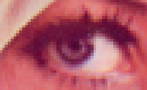

# GazeML

## Input



Ailia input shape: (2, 36, 60, 1)  
Range: [-1.0, 1.0]

## Output


Shape: (2, 36, 60, 18)  
Range: [0, 1.0]

## Usage
Automatically downloads the onnx and prototxt files on the first run.
It is necessary to be connected to the Internet while downloading.

For the sample image,
``` bash
$ python3 gazeml.py 
```

If you want to specify the input image, put the image path after the `--input` option.  
You can use `--savepath` option to change the name of the output file to save.
```bash
$ python3 gazeml.py --input IMAGE_PATH --savepath SAVE_IMAGE_PATH
```

By adding the `--video` option, you can input the video.   
If you pass `0` as an argument to VIDEO_PATH, you can use the webcam input instead of the video file.
```bash
$ python3 gazeml.py --video VIDEO_PATH
```

## Reference

[A deep learning framework based on Tensorflow for the training of high performance gaze estimation](https://github.com/swook/GazeML)

## Framework

TensorFlow 1.13.1

## Model Format

ONNX opset = 10

## Netron

[gazeml_elg_i60x36_n32.onnx.prototxt](https://lutzroeder.github.io/netron/?url=https://storage.googleapis.com/ailia-models/gazeml/gazeml_elg_i60x36_n32.onnx.prototxt)

[gazeml_elg_i180x108_n64.onnx.prototxt](https://lutzroeder.github.io/netron/?url=https://storage.googleapis.com/ailia-models/gazeml/gazeml_elg_i180x108_n64.onnx.prototxt)
