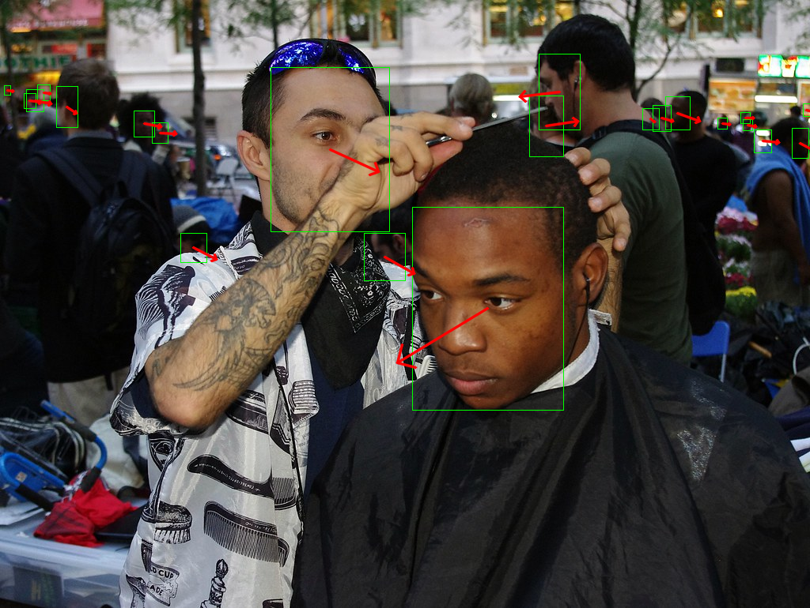

# L2CS-Net

## Input


Image credit: "Day 21 Occupy Wall Street October 6 2011 Shankbone 6" by david_shankbone is marked under CC PDM 1.0. To view the terms, visit https://creativecommons.org/publicdomain/mark/1.0/

## Output



## Usage

Automatically downloads the onnx and prototxt files on the first run.
It is necessary to be connected to the Internet while downloading.

For the sample image,
``` bash
$ python3 l2cs_net.py
```

If you want to specify the input image, put the image path after the `--input` option.  
You can use `--savepath` option to change the name of the output file to save.
```bash
$ python3 l2cs_net.py --input IMAGE_PATH --savepath SAVE_IMAGE_PATH
```

By adding the `--video` option, you can input the video.   
If you pass `0` as an argument to VIDEO_PATH, you can use the webcam input instead of the video file.
```bash
$ python3 l2cs_net.py --video VIDEO_PATH
```


## Reference

[L2CS-Net](https://github.com/ahmednull/l2cs-net)

## Framework

Pytorch = 1.9

## Model Format

ONNX opset = 9

## Netron

[l2cs.opt.prototxt](https://netron.app/?url=https://storage.googleapis.com/ailia-models/l2cs_net/l2cs.onnx.prototxt)

[retinaface_resnet50.onnx.prototxt](https://netron.app/?url=https://storage.googleapis.com/ailia-models/retinaface/retinaface_resnet50.onnx.prototxt)  
