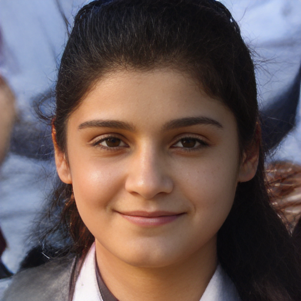

# codeformer : Towards Robust Blind Face Restoration with Codebook Lookup Transformer

## Input


(Image from https://github.com/sanghyun-son/EDSR-PyTorch/blob/master/test/0853x4.png)

Ailia input shape : (1, 3, 512, 512)  

## Output



Ailia output shape : (1, 3, 512 , 512)

## Usage
Automatically downloads the onnx and prototxt files when running.
It is necessary to be connected to the Internet while downloading.

For the sample image with twice the resolution,
``` bash
$ python3 codeformer.py
```

If you want to specify the input image, put the image path after the `--input` option.  
You can use `--savepath` option to change the name of the output file to save.
```bash
$ python3 codeformer.py --input IMAGE_PATH --savepath SAVE_IMAGE_PATH
```

If you want to specify the quality, put the scale after the `--fidelity_weight` option.
```bash
$ python3 codeformer.py --w 0.5
```

If you want to specify the cropped and aligned faces, put the scale after the `--has_aligned` option.
```bash
$ python3 codeformer.py --has_aligned
```

You can select a model from retinaface_resnet50 | retinaface_mobile0.25 by adding --arch 

```bash
$ python3 codeformer.py --video VIDEO_PATH
```


## Reference

[Towards Robust Blind Face Restoration with Codebook Lookup Transformer](https://github.com/sczhou/CodeFormer)

## Framework

Pytorch 1.10.0

## Model Format

ONNX opset = 10

## Netron

[codeformer.onnx.prototxt](https://netron.app/?url=https://storage.googleapis.com/ailia-models/codeformer/codeformer.onnx.prototxt)

[face_parse.onnx.prototxt](https://netron.app/?url=https://storage.googleapis.com/ailia-models/codeformer/face_parse.onnx.prototxt)

[retinaface_mobile0.25.onnx.prototxt](https://netron.app/?url=https://storage.googleapis.com/ailia-models/codeformer/retinaface_mobile0.25.onnx.prototxt)

[retinaface_resnet50.onnx.prototxt](https://netron.app/?url=https://storage.googleapis.com/ailia-models/codeformer/retinaface_resnet50.onnx.prototxt)


