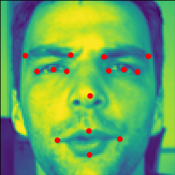

# ResNet Facial Feature Detection

### input

Shape: (1, 1, 226, 226) Range:[0, 1]

### output

 
The raw output of our model is a list of 15 coordinates of feature points.  
In the `facial_feature.py`, we place these points on the input image and resize it to 300pixels * 300pixels for easier understanding.

### Reference

[kaggle-facial-keypoints](https://github.com/axinc-ai/kaggle-facial-keypoints)

### Framework
PyTorch 1.2.0

### Model Format
ONNX opset = 10

### Netron

[resnet_facial_feature.onnx.prototxt](https://lutzroeder.github.io/netron/?url=https://storage.googleapis.com/ailia-models/resnet_facial_feature/resnet_facial_feature.onnx.prototxt)
