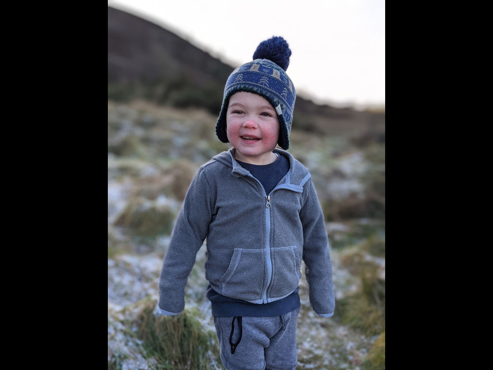

# FILM: Frame Interpolation for Large Motion

## Input

  

(Image from https://github.com/google-research/frame-interpolation/tree/main/photos)

## Output



## Usage

Automatically downloads the onnx and prototxt files on the first run.
It is necessary to be connected to the Internet while downloading.

For the sample images,
```bash
$ python3 film.py
```

If you want to specify the input image, put the first image path after the `--input` option, and the next image path after the `--input2` option.  
You can use `--savepath` option to change the name of the output file to save.
```bash
$ python3 film.py --input IMAGE_PATH1 --input2 IMAGE_PATH2 --savepath SAVE_IMAGE_PATH
```

The `--input` option can also specify the directory path where the images are located.
```bash
$ film film.py --input DIR_PATH
```

By adding the `--video` option, you can input the video.   
If you pass `0` as an argument to VIDEO_PATH, you can use the webcam input instead of the video file.
```bash
$ python3 film.py --video VIDEO_PATH --savepath SAVE_VIDEO_PATH
```

You can specify the number of times to perform recursive midpoint interpolation with the `--interpolate-times` option.
(default is 1.)
```bash
$ python3 film.py --interpolate-times 6
```

## Reference

- [FILM: Frame Interpolation for Large Motion](https://github.com/google-research/frame-interpolation)

## Framework

Tensorflow

## Model Format

ONNX opset=12

## Netron

[film_net.onnx.prototxt](https://netron.app/?url=https://storage.googleapis.com/ailia-models/film/film.onnx.prototxt)  
