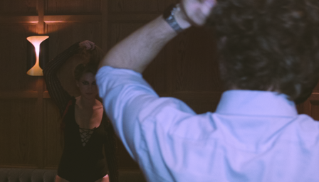
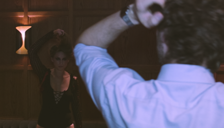

# FLAVR

## Input

    

(Image from Vimeo-90K dataset http://data.csail.mit.edu/tofu/dataset/vimeo_septuplet.zip)

## Output


## Usage

Automatically downloads the onnx and prototxt files on the first run.
It is necessary to be connected to the Internet while downloading.

For the sample images,

``` bash
$ python3 flavr.py
```

If you want to specify the input images, put the directory path of input images after the `--input` option.  
You can use `--savepath` option to change the name of the directory of the output file to save.

```bash
$ python3 flavr.py --input IMAGE_PATH --savepath SAVE_IMAGE_PATH
```

By adding the `--video` option, you can input the video.   
If you pass `0` as an argument to VIDEO_PATH, you can use the webcam input instead of the video file.

```bash
$ python3 flavr.py --video VIDEO_PATH --savepath SAVE_VIDEO_PATH
```

For multi frame interpolation model, you can specify the multiple of output frame (4 or 8) after the `-ip` option.

```bash
$ python3 flavr.py -ip 4
```

You can set output video size using `-hw` option.

```bash
$ python3 flavr.py -hw 544,960
```

## Reference

- [FLAVR: Flow-Agnostic Video Representations for Fast Frame Interpolation](https://github.com/tarun005/FLAVR)

## Framework

Pytorch

## Model Format

ONNX opset=11

## Netron

[FLAVR_2x.onnx.prototxt](https://netron.app/?url=https://storage.googleapis.com/ailia-models/flavr/FLAVR_2x.onnx.prototxt)  
[FLAVR_4x.onnx.prototxt](https://netron.app/?url=https://storage.googleapis.com/ailia-models/flavr/FLAVR_4x.onnx.prototxt)  
[FLAVR_8x.onnx.prototxt](https://netron.app/?url=https://storage.googleapis.com/ailia-models/flavr/FLAVR_8x.onnx.prototxt)
