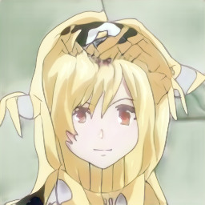

# Council-GAN

## glasses model

### Input


(Image from CelebA dataset http://mmlab.ie.cuhk.edu.hk/projects/CelebA.html)

### Output


## male2female model

### Input


(Image from CelebA dataset http://mmlab.ie.cuhk.edu.hk/projects/CelebA.html)

### Output


## selfie2anime model

### Input


(Image from CelebA dataset http://mmlab.ie.cuhk.edu.hk/projects/CelebA.html)

### Output



### usage
Automatically downloads the onnx and prototxt files on the first run.
It is necessary to be connected to the Internet while downloading.

For the sample image,
``` bash
$ python3 council-gan.py --glasses
```

You can also generate using male2female and selfie2anime model.

``` bash
$ python3 council-gan.py --m2f
$ python3 council-gan.py --anime
```

If you want to specify the input image, put the image path after the `--input` option.  
You can use `--savepath` option to change the name of the output file to save.
```bash
$ python3 council-gan.py --glasses --input IMAGE_PATH --savepath SAVE_IMAGE_PATH
```

By adding the `--video` option, you can input the video.   
If you pass `0` as an argument to VIDEO_PATH, you can use the webcam input instead of the video file.
```bash
$ python3 council-gan.py --glasses --video VIDEO_PATH
```

By adding the `--face_recognition` option, run face recognition with yolo v3 (only for glasses removal mode).
```bash
$ python3 council-gan.py --glasses --face_recognition --video 0
```


### Reference
[Council-GAN](https://github.com/Onr/Council-GAN)

### Framework
PyTorch 1.5.1

### Model Format
ONNX opset = 10

### Netron

[councilGAN-glasses.onnx.prototxt](https://lutzroeder.github.io/netron/?url=https://storage.googleapis.com/ailia-models/council-gan/councilGAN-glasses.onnx.prototxt)

[councilGAN-m2f_256.onnx.prototxt](https://lutzroeder.github.io/netron/?url=https://storage.googleapis.com/ailia-models/council-gan/councilGAN-m2f_256.onnx.prototxt)

[councilGAN-anime.onnx.prototxt](https://lutzroeder.github.io/netron/?url=https://storage.googleapis.com/ailia-models/council-gan/councilGAN-anime.onnx.prototxt)

