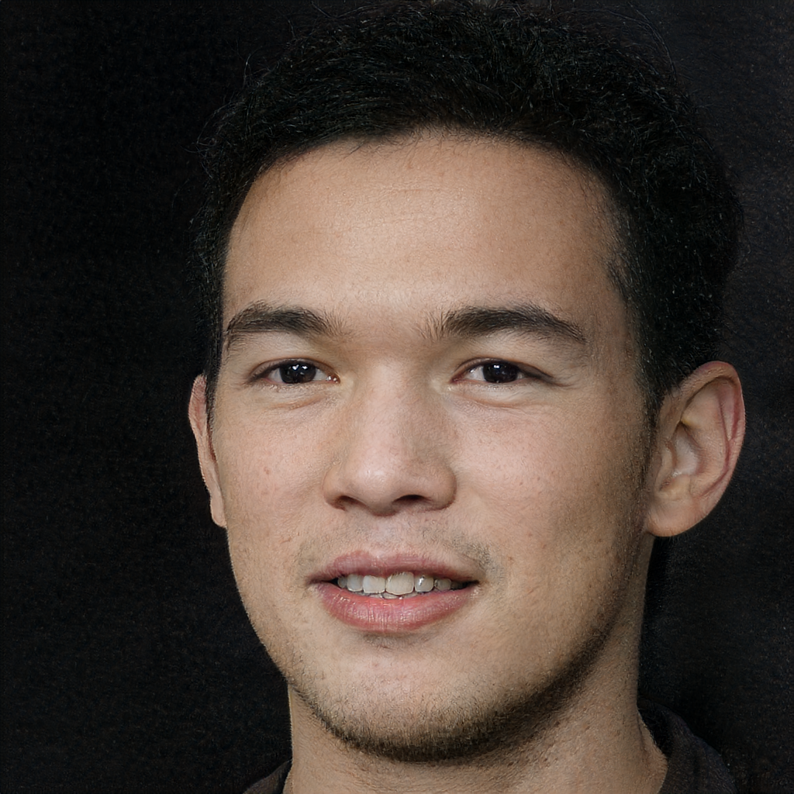

# encoder4editing

## Input

  

(Image from https://github.com/omertov/encoder4editing/tree/main/notebooks/images)

## Output

- inversion

    

- InterFaceGAN

  The age, smile and pose directions for the FFHQ StyleGAN Generator.

    

- GANSpace

  Editing the car domain and the face domain taken from the the official GANSpace.
  
  ○ ffhq
  
  
  ○ cars
    

- SeFa

  Apply to the selected edit parameters.
  

## Requirements
This model requires additional module.

```
pip3 install dlib     # for align face
```

## Usage
Automatically downloads the onnx and prototxt files on the first run.
It is necessary to be connected to the Internet while downloading.

For the sample image,
```bash
$ python3 encoder4editing.py
```

If you want to specify the input image, put the image path after the `--input` option.  
You can use `--savepath` option to change the name of the output file to save.
```bash
$ python3 encoder4editing.py --input IMAGE_PATH --savepath SAVE_IMAGE_PATH
```

By adding the `--model_type` option, you can specify model type which is selected from "ffhq", "car", "horse", "church". (default is ffhq)
```bash
$ python3 encoder4editing.py --model_type ffhq
```

If the input image is aligned, specify the `--aligned` option.  
In this case the dlib module is not needed.
```bash
$ python3 encoder4editing.py --aligned
```

Edit age, simile, pose by specifying 
`--age_factor`, `--age_range`, `--smile_factor`, `--smile_range`, `--pose_factor`, `--pose_range` parameters.

```bash
$ python3 encoder4editing.py --age_factor -3
```

```bash
$ python3 encoder4editing.py --age_range -5 5
```

The editings for the facial domain,  
sush as `--eye_openness`, `--smile`, `--trimmed_beard`, `--white_hair`, `--lipstick` options.
```bash
$ python3 encoder4editing.py --eye_openness 20 --smile -20 --trimmed_beard 20 --white_hair -24 --lipstick 20
```

The editings for the cars domain,  
such as `--car_view1`, `--car_view2`, `--car_cube`, `--car_color`, `--car_grass` options.
```bash
$ python3 encoder4editing.py -i example/car_img.jpg --model_type car --car_view1 2 --car_view2 -2 --car_cube 25 --car_color -8 --car_grass -18
```

Specify the using index, start/end distance and step, to set the edit parameters.
```bash
$ python3 encoder4editing.py --indices 2 3 4 5 --start_distance 0.0 --end_distance 15.0 --step 3
```

## Reference

- [Designing an Encoder for StyleGAN Image Manipulation](https://github.com/omertov/encoder4editing)

## Framework

Pytorch

## Model Format

ONNX opset=12

## Netron

[ffhq_encoder.onnx.prototxt](https://netron.app/?url=https://storage.googleapis.com/ailia-models/encoder4editing/ffhq_encoder.onnx.prototxt)  
[cars_encoder.onnx.prototxt](https://netron.app/?url=https://storage.googleapis.com/ailia-models/encoder4editing/carsencoder.onnx.prototxt)  
[horse_encoder.onnx.prototxt](https://netron.app/?url=https://storage.googleapis.com/ailia-models/encoder4editing/horse_encoder.onnx.prototxt)  
[church_encoder.onnx.prototxt](https://netron.app/?url=https://storage.googleapis.com/ailia-models/encoder4editing/church_encoder.onnx.prototxt)

[ffhq_decoder.onnx.prototxt](https://netron.app/?url=https://storage.googleapis.com/ailia-models/encoder4editing/ffhq_encoder.onnx.prototxt)  
[cars_decoder.onnx.prototxt](https://netron.app/?url=https://storage.googleapis.com/ailia-models/encoder4editing/cars_decoder.onnx.prototxt)  
[horse_decoder.onnx.prototxt](https://netron.app/?url=https://storage.googleapis.com/ailia-models/encoder4editing/horse_decoder.onnx.prototxt)  
[church_decoder.onnx.prototxt](https://netron.app/?url=https://storage.googleapis.com/ailia-models/encoder4editing/church_decoder.onnx.prototxt)
