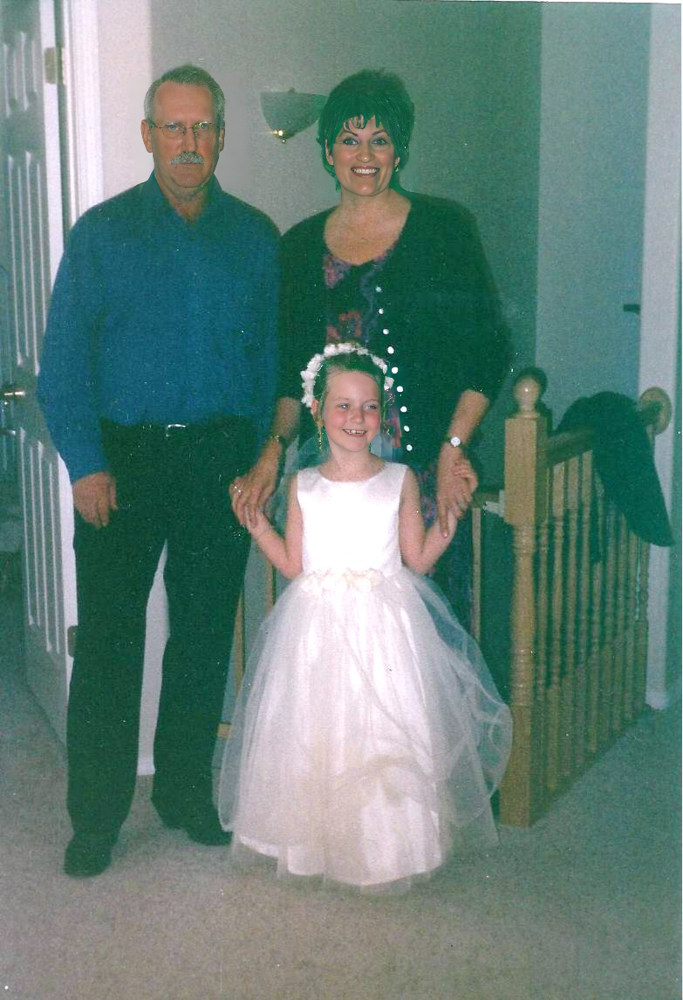

# GFP-GAN

## Input

### aligned


Shape : (1, 3, 512, 512)

### for face detection


(Image from https://github.com/TencentARC/GFPGAN/blob/master/inputs/whole_imgs/10045.png)

## Output

### aligned


Shape : (1, 3, 512, 512)

### for face detection



## Requirements
This model requires additional module.

```
# Install facexlib - https://github.com/xinntao/facexlib
# We use face restoration helper in the facexlib package
pip3 install facexlib

# If you want to enhance the background (non-face) regions with Real-ESRGAN,
# you also need to install the realesrgan package
# Install basicsr - https://github.com/xinntao/BasicSR
pip3 install basicsr
pip3 install realesrgan
```

## Usage
Automatically downloads the onnx and prototxt files on the first run.
It is necessary to be connected to the Internet while downloading.

For the sample image,
```bash
$ python3 gfpgan.py
```

If you want to specify the input image, put the image path after the `--input` option.  
You can use `--savepath` option to change the name of the output file to save.
```bash
$ python3 gfpgan.py --input IMAGE_PATH --savepath SAVE_IMAGE_PATH
```

By adding the `--video` option, you can input the video.   
If you pass `0` as an argument to VIDEO_PATH, you can use the webcam input instead of the video file.
```bash
$ python3 gfpgan.py --video VIDEO_PATH
```

If the input image is aligned, specify the `--aligned` option.
```bash
$ python3 gfpgan.py --aligned
```

If you want to use the facexlib module for face restoration in face detection mode, specify the `--facexlib` option.
```bash
$ python3 gfpgan.py --facexlib
```

If you upsampling the image, specify the `--upscale` option with scale value. 
In addition, if you with Real-ESRGAN, specify the `--realesrgan` option.
```bash
$ python3 gfpgan.py --upscale 2 --realesrgan
```

## Reference

- [GFPGAN](https://github.com/TencentARC/GFPGAN)
- [FaceXLib](https://github.com/xinntao/facexlib)

## Framework

Pytorch

## Model Format

ONNX opset=11

## Netron

[GFPGANv1.3.onnx.prototxt](https://netron.app/?url=https://storage.googleapis.com/ailia-models/gfpgan/GFPGANv1.3.onnx.prototxt)  
[retinaface_resnet50.onnx.prototxt](https://netron.app/?url=https://storage.googleapis.com/ailia-models/gfpgan/retinaface_resnet50.onnx.prototxt)
