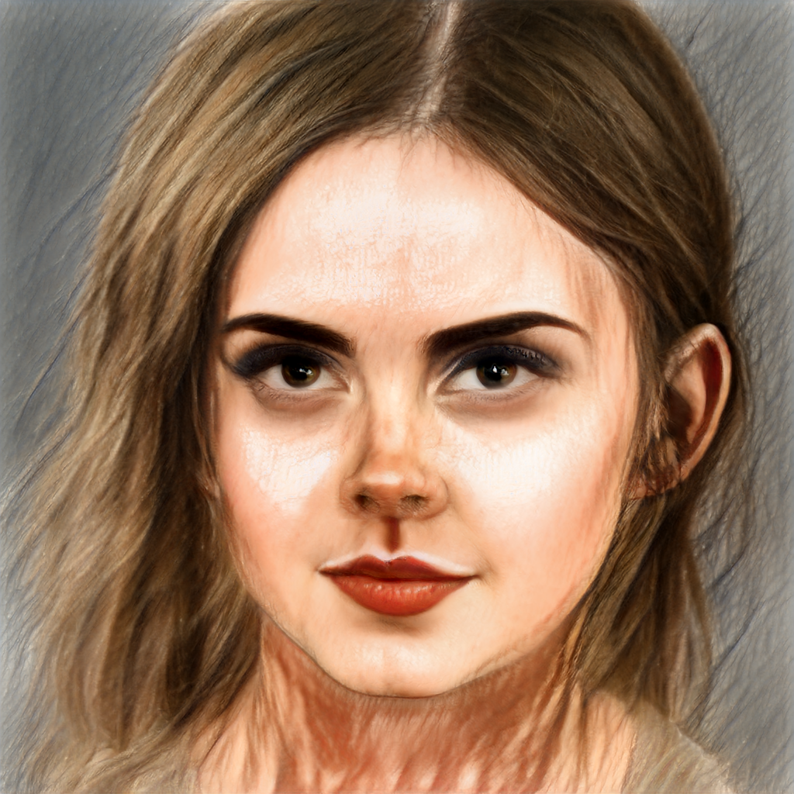

# Hyperstyle

## Input

[](img/watson.jpg)

(Image from https://github.com/yuval-alaluf/hyperstyle/blob/main/notebooks/images/animations/)

Shape : (1, 3, 1024, 1024)

Face alignment and reshaped to : (1, 3, 256, 256)  

## Output

Shape : (1, 3, 1024, 1024)

### Inversion task

[](img/watson-latent.png)

### Domain adaptation task

| [](img/watson-cartoon.png) | [](img/watson-disney-princess.png) | [](img/watson-pixar.png) | [](img/watson-sketch.png) |
|:--------------:|:------------:|:------------:|:------------:|
| <b>Cartoon</b> | <b>Disney Princess</b> | <b>Pixar</b> | <b>Sketch</b> | 

## Usage
Automatically downloads the onnx and prototxt files on the first run.
It is necessary to be connected to the Internet while downloading.

The options `--inversion` and `--adaptation` enable you to choose the task to run. You can use both simultaneously, but should at least provide one.

For the sample image (inversion),
```bash
$ python3 hyperstyle.py --inversion
```

For the sample image (cartoon domain adaptation),
```bash
$ python3 hyperstyle.py --adaptation
```

If you want to specify the input image, put the image path after the `--input` option.  
You can use `--savepath` option to change the name of the output file to save.
```bash
$ python3 hyperstyle.py --inversion --adaptation --input IMAGE_PATH --savepath SAVE_IMAGE_PATH 
```

By specifying the `-m` option, you can choose the domain for the domain adaptation task. This argument must be one of the following: `cartoon`, `disney-princess`, `pixar`, or `sketch`.
```bash
$ python3 hyperstyle.py --adaptation -m pixar
```

By specifying the `-iter` option, you can choose how many iterations you want to generate the output image (default 2).
```bash
$ python3 hyperstyle.py --inversion --adaptation -iter 5 
```

By specifying the `--side_by_side` option, the input image will be saved side-by-side with the output image.
```bash
$ python3 hyperstyle.py --inversion --adaptation --side_by_side 
```

By adding the `--video` option, you can input the video.   
If you pass `0` as an argument to VIDEO_PATH, you can use the webcam input instead of the video file.
```bash
$ python3 hyperstyle.py --adaptation --video VIDEO_PATH 
```

By adding the `--use_dlib` option, you can use original version of face alignment.

## Reference

- [HyperStyle](https://github.com/yuval-alaluf/hyperstyle)

- [PSGAN](https://github.com/axinc-ai/ailia-models/tree/master/style_transfer/psgan) (face alignment without dlib)

## Framework

Pytorch 1.10.0

Python 3.6.7+

## Model Format

ONNX opset=11
