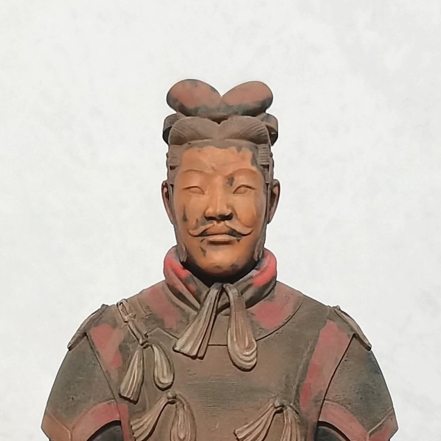
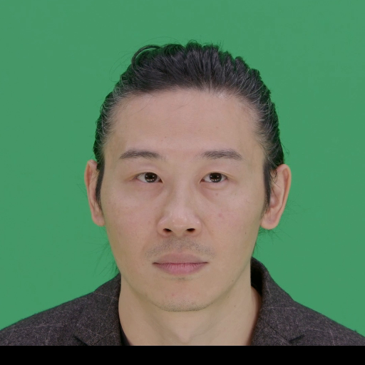
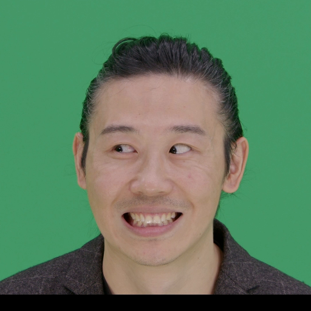
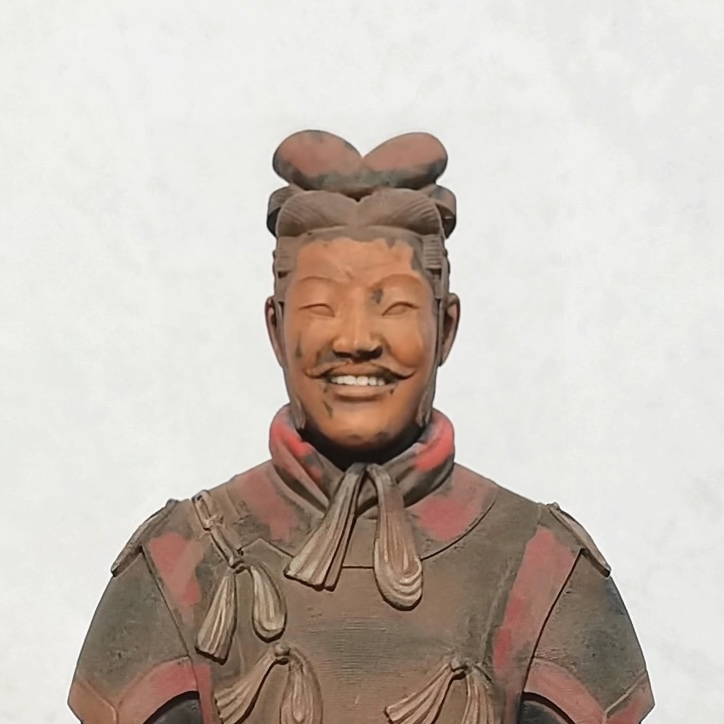
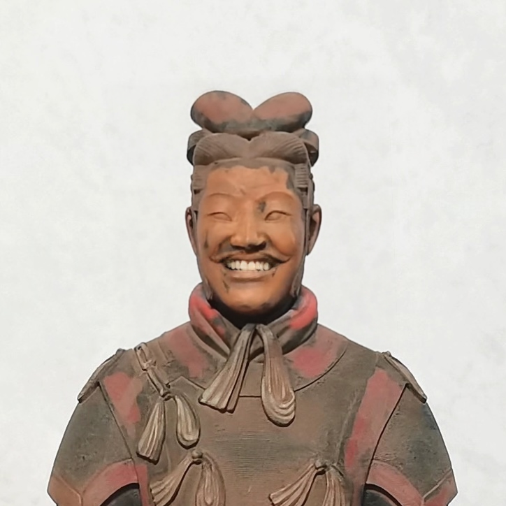

# LivePortrait

## Input

- Source Portrait

  

  (Image from https://github.com/KwaiVGI/LivePortrait/blob/main/assets/examples/source/s6.jpg)
  
- Driving Video

  
  
  

  (Video from https://github.com/KwaiVGI/LivePortrait/blob/main/assets/examples/driving/d0.mp4)

## Output

- Animated Video

  
  
  

## Usage
Automatically downloads the onnx and prototxt files on the first run.
It is necessary to be connected to the Internet while downloading.

For the sample image,
```bash
$ python3 live_portrait.py
```

If you want to specify the source image, put the image path after the `--input` option.  
The driving video can be specified with the `--driving` option.  
You can use `--savepath` option to change the name of the output file to save.
```bash
$ python3 live_portrait.py --input SOURCE_IMAGE --driving DRIVING_VIDEO --savepath SAVE_IMAGE_PATH
```

By adding the `--video` option, you can input the video.   
If you pass `0` as an argument to VIDEO_PATH, you can use the webcam input instead of the video file.
```bash
$ python3 live_portrait.py --video VIDEO_PATH
```

If you specify the `--composite` option, the driving frame and source image and animated frame to be drawn together.
```bash
$ python3 live_portrait.py --composite
```

## Reference

- [LivePortrait](https://github.com/KwaiVGI/LivePortrait)
- [hugging face - KwaiVGI/LivePortrait](https://huggingface.co/spaces/KwaiVGI/LivePortrait)

## Framework

Pytorch

## Model Format

- landmark.onnx.prototxt

  ONNX opset=13

- appearance_feature_extractor.onnx.prototxt
- motion_extractor.onnx.prototxt
- spade_generator.onnx.prototxt
- stitching.onnx.prototxt

  ONNX opset=17

- warping_module.onnx.prototxt

  ONNX opset=20

## Netron

[appearance_feature_extractor.onnx.prototxt](https://netron.app/?url=https://storage.googleapis.com/ailia-models/live_portrait/appearance_feature_extractor.onnx.prototxt)  
[motion_extractor.onnx.prototxt](https://netron.app/?url=https://storage.googleapis.com/ailia-models/live_portrait/motion_extractor.onnx.prototxt)  
[warping_module.onnx.prototxt](https://netron.app/?url=https://storage.googleapis.com/ailia-models/live_portrait/warping_module.onnx.prototxt)  
[spade_generator.onnx.prototxt](https://netron.app/?url=https://storage.googleapis.com/ailia-models/live_portrait/spade_generator.onnx.prototxt)  
[stitching.onnx.prototxt](https://netron.app/?url=https://storage.googleapis.com/ailia-models/live_portrait/stitching.onnx.prototxt)  
[landmark.onnx.prototxt](https://netron.app/?url=https://storage.googleapis.com/ailia-models/live_portrait/landmark.onnx.prototxt)
