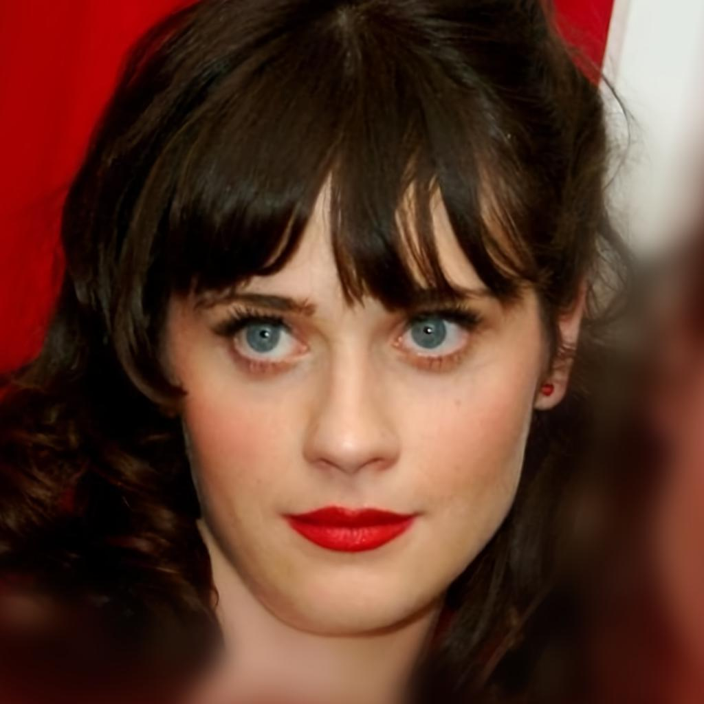

# Restyle Encoder

## Input



(Image from https://github.com/yuval-alaluf/restyle-encoder/blob/main/notebooks/images/face_img.jpg)

Shape : (1, 3, 1024, 1024)

Face alignment and reshaped to : (1, 3, 256, 256)  

## Output


From left to right: 1st, 2nd, 3rd, 4th, 5th iteration, and original (face aligned) image.

## Usage
Automatically downloads the onnx and prototxt files on the first run.
It is necessary to be connected to the Internet while downloading.

For the sample image,
```bash
$ python3 restyle-encoder.py
```

By specifying the `-iter` option, you can choose how many iterations you want to generate the output image (default 5).
```bash
$ python3 restyle-encoder.py -iter 3
```

By adding the `--video` option, you can input the video.   
If you pass `0` as an argument to VIDEO_PATH, you can use the webcam input instead of the video file.
```bash
$ python3 restyle-encoder.py --video VIDEO_PATH
```

## Reference

- [Restyle Encoder](https://github.com/yuval-alaluf/restyle-encoder)

## Framework

Pytorch 1.10.0

Python 3.6.7+

## Model Format

ONNX opset=11

## Netron

[restyle-encoder.onnx.prototxt](https://lutzroeder.github.io/netron/?url=https://storage.googleapis.com/ailia-models/restyle-encoder/restyle-encoder.onnx.prototxt)

[face-pool.onnx.prototxt](https://lutzroeder.github.io/netron/?url=https://storage.googleapis.com/ailia-models/restyle-encoder/face-pool.onnx.prototxt)
