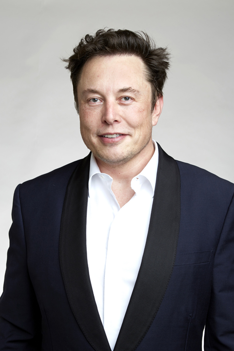
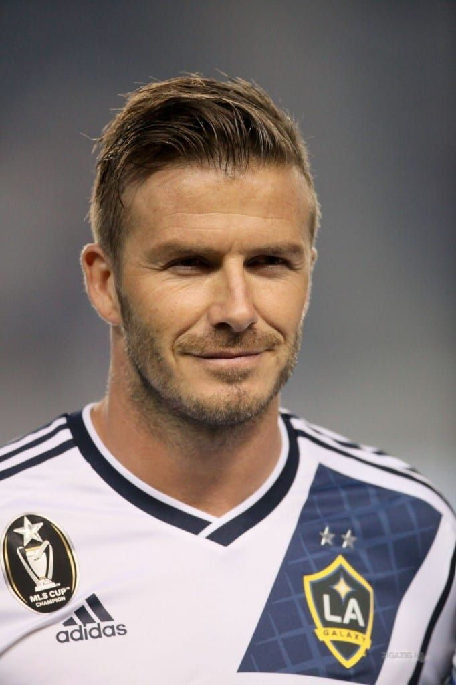

# SberSwap

## Input

- Source image



- Target image



(Image from https://github.com/ai-forever/sber-swap/tree/main/examples/images)

## Requirements
This model requires additional module.

```
pip3 install mxnet
```

## Output


## Usage
Automatically downloads the onnx and prototxt files on the first run.
It is necessary to be connected to the Internet while downloading.

For the sample image,
```bash
$ python3 sber-swap.py
```

If you want to specify the target image, put the image path after the `--input` option.  
The source image can be specified with the `--source` option.  
You can use `--savepath` option to change the name of the output file to save.
```bash
$ python3 sber-swap.py --input TARGET_IMAGE --source SOURCE_IMAGE --savepath SAVE_IMAGE_PATH
```

By adding the `--video` option, you can input the video.   
If you pass `0` as an argument to VIDEO_PATH, you can use the webcam input instead of the video file.
```bash
$ python3 sber-swap.py --video VIDEO_PATH
```

## Reference

- [SberSwap](https://github.com/ai-forever/sber-swap)

## Framework

Pytorch

## Model Format

ONNX opset=11

## Netron

[G_unet_2blocks.onnx.prototxt](https://netron.app/?url=https://storage.googleapis.com/ailia-models/sber-swap/G_unet_2blocks.onnx.prototxt)  
[scrfd_10g_bnkps.onnx.prototxt](https://netron.app/?url=https://storage.googleapis.com/ailia-models/sber-swap/scrfd_10g_bnkps.onnx.prototxt)  
[arcface_backbone.onnx.prototxt](https://netron.app/?url=https://storage.googleapis.com/ailia-models/sber-swap/arcface_backbone.onnx.prototxt)
