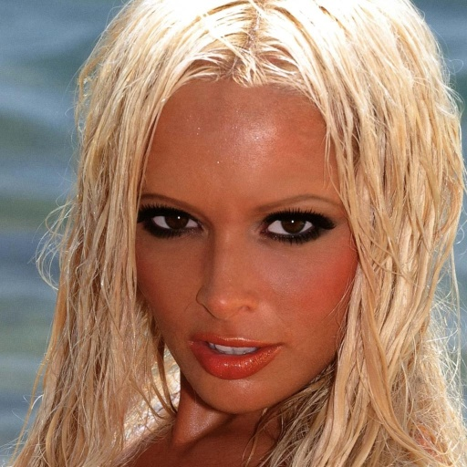
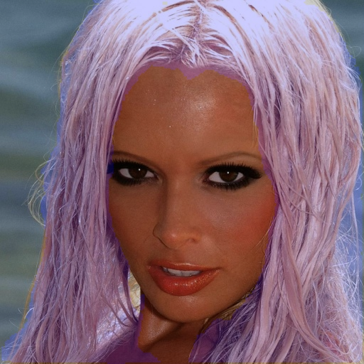

# Hair segmentation

### Input


(from https://github.com/thangtran480/hair-segmentation/tree/master/assets)

Ailia input shape(1, 224, 224, 3)  
Range:[0, 1]

### Output



### Usage
Automatically downloads the onnx and prototxt files on the first run. It is necessary to be connected to the Internet while downloading.

For the sample image,
```
$ python3 hair_segmentation.py
```

If you want to specify the input image, put the image path after the `--input` option.
You can use `--savepath` option to change the name of the output file to save.
```
$ python3 hair_segmentation.py --input IMAGE_PATH --savepath SAVE_IMAGE_PATH
```

By adding the `--video` option, you can input the video.
If you pass `0` as an argument to VIDEO_PATH, you can use the webcam input instead of the video file.
```
$ python3 hair_segmentation.py --video VIDEO_PATH
```

### Reference

[hair segmentation in mobile device](https://github.com/thangtran480/hair-segmentation)

### Framework
Keras 2.2.4

### Model Format
ONNX opset = 10

### Netron

[hair_segmentation.onnx.prototxt](https://lutzroeder.github.io/netron/?url=https://storage.googleapis.com/ailia-models/hair_segmentation/hair_segmentation.onnx.prototxt)

[hair_segmentation.opt.onnx.prototxt](https://lutzroeder.github.io/netron/?url=https://storage.googleapis.com/ailia-models/hair_segmentation/hair_segmentation.opt.onnx.prototxt)
