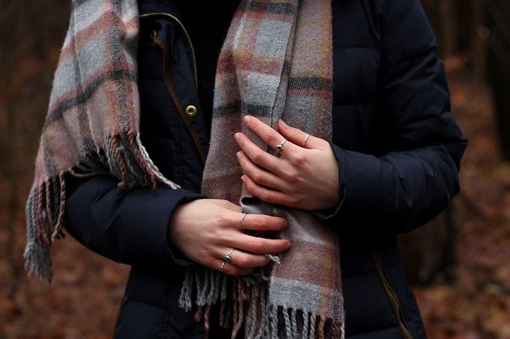

# BlazePalm

## Input



(Image from https://pixabay.com/photos/person-human-woman-young-body-3929040/)

- ailia input shape: (1, 3, 256, 256) RGB channel order
- Pixel value range: [0, 1]

## Output


- ailia Predict API output:
  - Bounding boxes and keypoints
    - Shape: (1, 2944, 18)
  - Classification confidences
    - Shape: (1, 2944, 1)
- With helper functions, filtered detections with keypoints can be obtained.

## Usage

Automatically downloads the onnx and prototxt files on the first run.
It is necessary to be connected to the Internet while downloading.

For the sample image,
``` bash
$ python3 blazepalm.py 
```

If you want to specify the input image, put the image path after the `--input` option.  
You can use `--savepath` option to change the name of the output file to save.
```bash
$ python3 blazepalm.py --input IMAGE_PATH --savepath SAVE_IMAGE_PATH
```

By adding the `--video` option, you can input the video.   
If you pass `0` as an argument to VIDEO_PATH, you can use the webcam input instead of the video file.
```bash
$ python3 blazepalm.py --video VIDEO_PATH --savepath SAVE_VIDEO_PATH
```

## Reference

- [MediaPipePyTorch](https://github.com/zmurez/MediaPipePyTorch)
- [MediaPipe Hands](https://google.github.io/mediapipe/solutions/hands.html)

## Framework

PyTorch 1.7.1


## Model Format

ONNX opset = 11


## Netron

[blazepalm.onnx.prototxt](https://netron.app/?url=https://storage.googleapis.com/ailia-models/blazepalm/blazepalm.onnx.prototxt)


