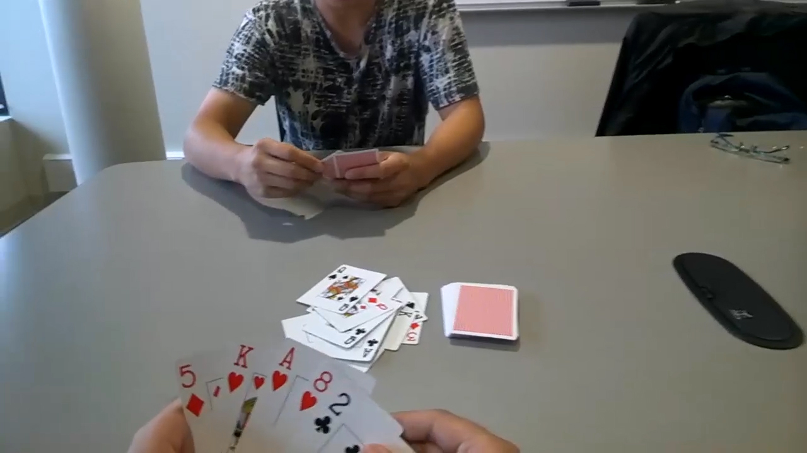

# hand-detection.PyTorch

## Input



## Output


(Images above are from [https://github.com/zllrunning/hand-detection.PyTorch/tree/master/data/video](https://github.com/zllrunning/hand-detection.PyTorch/tree/master/data/video))

## Usage
Automatically downloads the onnx and prototxt files on the first run.
It is necessary to be connected to the Internet while downloading.

For the sample image,
```
$ python3 hand_detection_pytorch.py
```

If you want to specify the input image, put the image path after the `--input` option.  
You can use `--savepath` option to change the name of the output file to save.
```
$ python3 hand_detection_pytorch.py --input IMAGE_PATH --savepath SAVE_IMAGE_PATH
```

By adding the `--video` option, you can input the video.   
If you pass `0` as an argument to VIDEO_PATH, you can use the webcam input instead of the video file.
```
$ python3 hand_detection_pytorch.py --video VIDEO_PATH
```

## Reference

- [hand-detection.PyTorch](https://github.com/zllrunning/hand-detection.PyTorch)

## Framework

PyTorch 0.4.0 or more

## Model Format

ONNX opset=10

## Netron

[hand_detection.onnx.prototxt]()

