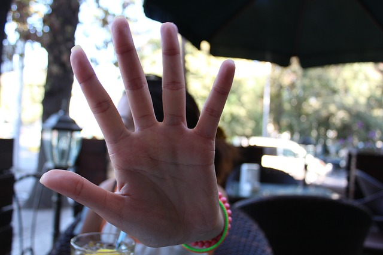

# BlazeHand

## Input



(Image from https://pixabay.com/photos/stop-no-photo-no-photographing-hand-565609/)

### Detector

- ailia input shape: (1, 3, 256, 256) RGB channel order
- Pixel value range: [0, 1]

### Landmark

- ailia input shape: (batch_size, 3, 256, 256) BGR channel order
- Pixel value range: [0, 1]

## Output


### Detector

- ailia Predict API output:
  - Bounding boxes and keypoints
    - Shape: (1, 896, 18)
  - Classification confidences
    - Shape: (1, 896, 1)
- With helper functions, filtered detections with keypoints can be obtained.

### Estimator

- ailia Predict API output:
  - `hand_flag`: confidence score [0, 1] of hand presence
    - Shape: (batch_size,)
  - `handedness`: classification score [0.5, 1] of handedness
    - Shape: (batch_size,)
    - Estimated probability of the predicted handedness is always greater
    than or equal to 0.5 (and the opposite handedness has an estimated
    probability of 1 - score).
    - Handedness is determined assuming the input image is mirrored, i.e.,
    taken with a front-facing/selfie camera with images flipped horizontally.
    If it is not the case, please swap the handedness output in the application.
  - `landmarks`: 21 hand landmarks with (x, y, z) coordinates
    - Shape: (batch_size, 21, 3)
    - x and y are normalized to [0.0, 1.0] by the image width and height
    respectively. z represents the landmark depth with the depth at the wrist
    being the origin, and the smaller the value the closer the landmark is to
    the camera. The magnitude of z uses roughly the same scale as x.
- With helper functions, image coordinates of hand landmarks can be obtained.

## Usage

Automatically downloads the onnx and prototxt files on the first run.
It is necessary to be connected to the Internet while downloading.

For the sample image,
``` bash
$ python3 blazehand.py 
```

If you want to specify the input image, put the image path after the `--input` option.  
You can use `--savepath` option to change the name of the output file to save.
```bash
$ python3 blazehand.py --input IMAGE_PATH --savepath SAVE_IMAGE_PATH
```

By adding the `--video` option, you can input the video.   
If you pass `0` as an argument to VIDEO_PATH, you can use the webcam input instead of the video file.
```bash
$ python3 blazehand.py --video VIDEO_PATH --savepath SAVE_VIDEO_PATH
```

## Reference

- [MediaPipePyTorch](https://github.com/zmurez/MediaPipePyTorch)
- [MediaPipe Hands](https://google.github.io/mediapipe/solutions/hands.html)

## Framework

PyTorch 1.7.1


## Model Format

ONNX opset = 11

## Netron

[blazehand.onnx.prototxt](https://netron.app/?url=https://storage.googleapis.com/ailia-models/blazehand/blazehand.onnx.prototxt)


