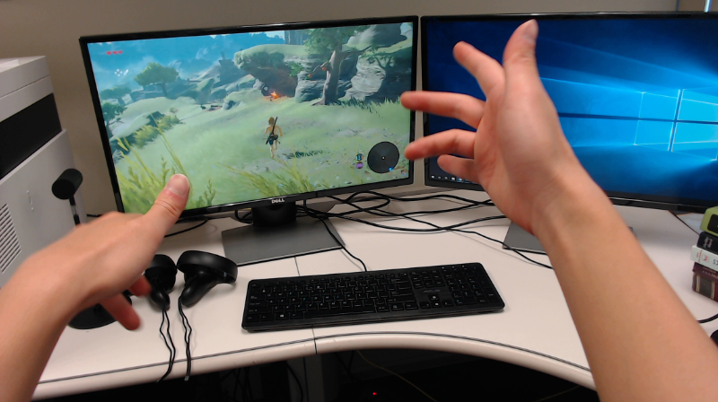

*# Ego2Hands - Egocentric Two-hand Segmentation and Detection
## Input

* **Image or Video**




## Output

* **Predicted mask**


Estimated mask of the hands (without option ```--overlay```),
or a mask overlayed over the original image (with option ```--overlay```).

The result will be saved to ```./output.png``` by default but it can be specified with the ```-s``` option

* **Energy prediction**


The segmentation mask predicts all region of your arms but the "energy" prediction will focus on the position of your hands. This can also be used to create a bounding box of the hands.

The result will be saved to ```./output.png``` by default but it can be specified with the ```-s``` option. For this output, the result will be saved to a path with "_energy" inserted before the extension.

## Usage
An Internet connection is required when running the script for the first time, as the model files will be downloaded automatically.

The predicted mask of the hands in the input media will be generated by running the script.

#### Example 1: Inference on prepared demo image.
```bash
$ python3 ego2hands.py
```

#### Example 2: Specify input path, save path.
```bash
$ python3 ego2hands.py -i input.png -s output.png
```
The ```-i``` and ```-s``` options can be used to specify the input path and the save path, respectively.
In this example, the segmentation result will be saved to output.png, and the energy result will be saved to output_energy.png.

#### Example 3: Specify the size of the image, and visualize the overlayed mask.
```bash
$ python3 ego2hands.py --width 256 --height 512 --overlay
```
Use options ```--width``` and ```height``` to specify the image size on which the model will be running inference.
The result will always be resized to the original size of the image.
You can visualize the result with a mask overlayed over the original image using the option ```--overlay```.

#### Example 4: Inference on Video.
```bash
$ python3 ego2hands.py -v 0
```
argument after the ```-v``` option can be the device ID of the webcam,
or the path to the input video.

## Reference

* [Ego2Hands](https://github.com/AlextheEngineer/Ego2Hands)

## Framework

Pytorch


## Model Format

ONNX opset=11

## Netron

- [ego2hands.onnx.prototxt](https://netron.app/?url=https://storage.googleapis.com/ailia-models/ego2hands/ego2hands.onnx.prototxt)
*