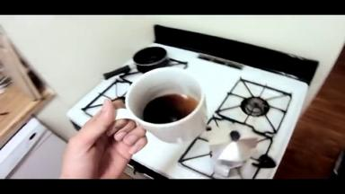
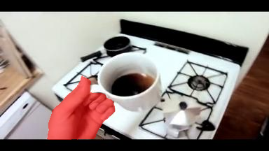

# Hands Segmentation - A Plug and Play Model
## Input

* **Image or Video**




## Output

* **Predicted mask**



Estimated mask of the hands(without option ```--overlay```),
or a mask overlayed over the original image(with option ```--overlay```).
The image above was made with the overlay option enabled.

The result will be saved to ```./output.png``` by default but it can be specified with the ```-s``` option 

## Usage
An Internet connection is required when running the script for the first time, as the model files will be downloaded automatically.

The predicted mask of the hands in the input media will be generated by running the script.

#### Example 1: Inference on prepared demo image.
```bash
$ python3 hands_segmentation_pytorch.py
```

#### Example 2: Specify input path, save path.
```bash
$ python3 hands_segmentation_pytorch.py -i input.png -s output.png
```
```-i```, ```-s``` options can be used to specify the
input path and the save path. 

#### Example 3: Specify the size of the image, and visualize the overlayed mask.
```bash
$ python3 hands_segmentation_pytorch.py --width 512 --height 512 --overlay
```
Use options ```--width``` and ```height``` to specify the image size on which the model will be running inference.
The result will always be resized to the original size of the image.
You can visualize the result with a mask overlayed over the original image using the option ```--overlay```.

#### Example 4: Inference on Video.
```bash
$ python3 hands_segmentation_pytorch.py -v 0
```
argument after the ```-v``` option can be the device ID of the webcam,
or the path to the input video.

## Reference

* [hands-segmentation-pytorch](https://github.com/guglielmocamporese/hands-segmentation-pytorch)

## Framework

Pytorch


## Model Format

ONNX opset=11

## Netron

- [hands_segmentation_pytorch.onnx.prototxt](https://netron.app/?url=https://storage.googleapis.com/ailia-models/hands_segmentation_pytorch/hands_segmentation_pytorch.onnx.prototxt)
