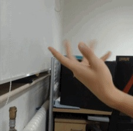

# Minimal Hand

## Input



(Image from http://zatugaku1128.com/wp-content/uploads/2016/06/%E5%B7%A6%E6%89%8B-300x297.jpg)

## Output


## Usage
Automatically downloads the onnx and prototxt files on the first run.
It is necessary to be connected to the Internet while downloading.

For the sample image,
``` bash
$ python3 minimal-hand.py
```

If you want to specify the input image, put the image path after the `--input` option.  
```bash
$ python3 minimal-hand.py --input IMAGE_PATH
```

The pre-trained model is for left hand.  
If you want to input the right hand image, add the `--right-hand` option it will be flipped internally.
```bash
$ python3 minimal-hand.py --right-hand
```

By adding the `--video` option, you can input the video.   
If you pass `0` as an argument to VIDEO_PATH, you can use the webcam input instead of the video file.
```bash
$ python3 minimal-hand.py --video VIDEO_PATH
```

## Reference

- [Minimal Hand](https://github.com/CalciferZh/minimal-hand)

## Framework

ONNX Runtime

## Model Format

ONNX opset = 11

## Netron

- [detnet.onnx.prototxt](https://netron.app/?url=https://storage.googleapis.com/ailia-models/minimal-hand/detnet.onnx.prototxt)
