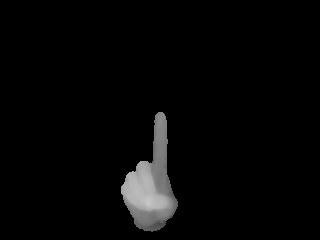
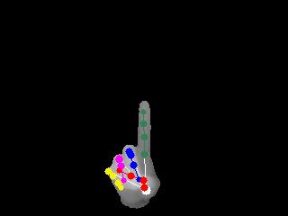

# V2V-PoseNet

Voxel-to-Voxel Prediction Network for Accurate 3D Hand and Human Pose Estimation from a Single Depth Map.

## Input



(The depth map from [MSRA Hand Gesture Dataset](https://jimmysuen.github.io/))

## Output

- inference


- ground-truth



## Usage
For the various examples other than the sample image,
it is necessary to download [MSRA Hand Gesture Dataset](https://jimmysuen.github.io/) and extract to `msra_dataset` directory as below.
```
v2v-posenet
├── msra_dataset
  ├── P0
  ...
  ├── P3
    ├── 1
      ├── 000000_depth.bin
      ├── 000001_depth.bin
      ...
      ├── joint.txt
    ├── 2
    ...
```

And also it use the precomputed centers.  
The precomputed centers are obtained by training the hand center estimation network from [DeepPrior++](https://arxiv.org/pdf/1708.08325.pdf).
* MSRA Hand Pose Dataset [[center](https://cv.snu.ac.kr/research/V2V-PoseNet/MSRA/center/center.tar.gz)] [[estimation](https://cv.snu.ac.kr/research/V2V-PoseNet/MSRA/coordinate/result.txt)]

Automatically downloads the onnx and prototxt files on the first run.
It is necessary to be connected to the Internet while downloading.

For the sample image,
``` bash
$ python3 v2v-posenet.py
```

If you want to specify the input depthmap, put the image path after the `--input` option.  
```bash
$ python3 v2v-posenet.py --input DEPTH_MAP
```

You can draw ground-truth keypoints by specifying the `--gt` option.
```bash
$ python3 v2v-posenet.py --gt
```

## Reference

- [V2V-PoseNet](https://github.com/mks0601/V2V-PoseNet_RELEASE)
- [V2V-PoseNet-pytorch](https://github.com/dragonbook/V2V-PoseNet-pytorch)

## Framework

Pytorch

## Model Format

ONNX opset = 11

## Netron

- [msra-subject3-epoch15.onnx.prototxt](https://netron.app/?url=https://storage.googleapis.com/ailia-models/v2v-posenet/msra-subject3-epoch15.onnx.prototxt)
