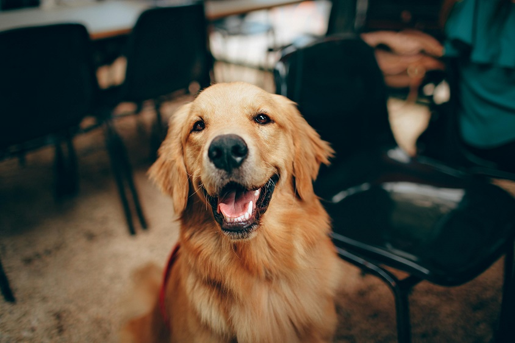

# clip-japanese-base

## Input



(Image from https://images.pexels.com/photos/2253275/pexels-photo-2253275.jpeg)

## Output

```
+ idx=0
  category=0[犬 ]
  prob=1.0
+ idx=1
  category=2[象 ]
  prob=0.0
+ idx=2
  category=1[猫 ]
  prob=0.0
```

## Requirements
This model requires additional module.

```
pip3 install transformers
```

## Usage
Automatically downloads the onnx and prototxt files on the first run.
It is necessary to be connected to the Internet while downloading.

For the sample image,
```bash
$ python3 clip-japanese-base.py
```

If you want to specify the input image, put the image path after the `--input` option.
```bash
$ python3 clip-japanese-base.py --input IMAGE_PATH
```

You can use `--text` option  if you want to specify a subset of the texture labels to input into the model.  
Default labels is "犬", "猫" and "象".
```bash
$ python3 clip-japanese-base.py --text "犬" --text "猫" --text "象"
```

If you want to load a subset of the texture labels you input into the model from a file, use the `--desc_file` option.
```bash
$ python3 clip-japanese-base.py --desc_file imagenet_classes.txt
```

## Reference

- [line-corporation/clip-japanese-base](https://huggingface.co/line-corporation/clip-japanese-base)

## Framework

Pytorch

## Model Format

ONNX opset=17

## Netron

[encode_image.onnx.prototxt](https://netron.app/?url=https://storage.googleapis.com/ailia-models/clip-japanese-base/encode_image.onnx.prototxt)  
[encode_text.onnx.prototxt](https://netron.app/?url=https://storage.googleapis.com/ailia-models/clip-japanese-base/encode_text.onnx.prototxt)  
