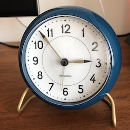

# InceptionV4

## Input



Ailia input shape: (1,3,299,299)
Range: [0.0, 255.0]

## Output
```
class_count=3
+ idx=0
  category=410[analog clock ]
  prob=0.7630504965782166
+ idx=1
  category=893[wall clock ]
  prob=0.11131250858306885
+ idx=2
  category=531[digital clock ]
  prob=0.0013923249207437038
```

## Usage
Automatically downloads the onnx and prototxt files on the first run.
It is necessary to be connected to the Internet while downloading.

For the sample image,
``` bash
$ python3 inceptionv4.py
```

If you want to specify the input image, put the image path after the `--input` option.  
```bash
$ python3 inceptionv4.py --input IMAGE_PATH
```

By adding the `--video` option, you can input the video.   
If you pass `0` as an argument to VIDEO_PATH, you can use the webcam input instead of the video file.
```bash
$ python3 inceptionv4.py --video VIDEO_PATH
```

## Reference

[Keras Inception-V4](https://github.com/kentsommer/keras-inceptionV4)

## Model Format

ONNX opset = 11

## Framework

Pytorch

## Netron

[inceptionv4.onnx.prototxt](https://netron.app/?url=https://storage.googleapis.com/ailia-models/inceptionv4/inceptionv4.opt.onnx.prototxt)
