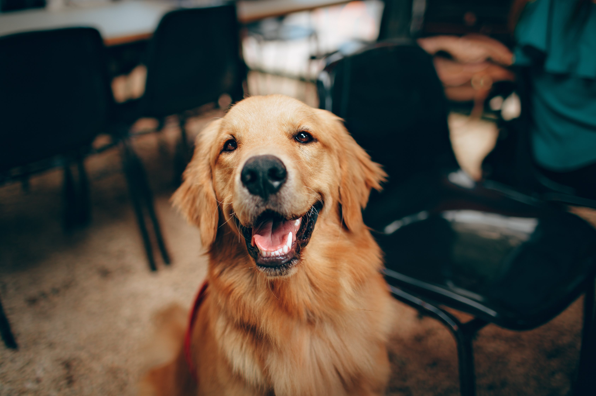

# Japanese-CLIP

## Input



(Image from https://github.com/rinnakk/japanese-clip/blob/master/data/dog.jpeg)

## Output

```bash
class_count=3
+ idx=0
  category=0[犬 ]
  prob=1.0
+ idx=1
  category=2[象 ]
  prob=0.0
+ idx=2
  category=1[猫 ]
  prob=0.0
```

## Requirements
This model requires additional module.

```
pip3 install transformers
```

## Usage
Automatically downloads the onnx and prototxt files on the first run.
It is necessary to be connected to the Internet while downloading.

For the sample image,
```bash
$ python3 japanese-clip.py
```

If you want to specify the input image, put the image path after the `--input` option.
```bash
$ python3 japanese-clip.py --input IMAGE_PATH
```

You can use `--text` option  if you want to specify a subset of the texture labels to input into the model.  
Default labels is "犬", "猫" and "象".
```bash
$ python3 japanese-clip.py --text "犬" --text "猫" --text "象"
```

By adding the `--model_type` option, you can specify model type which is selected from "clip", "cloob". (default is clip)
```bash
$ python3 japanese-clip.py --model_type clip
```

## Reference

- [Japanese-CLIP](https://github.com/rinnakk/japanese-clip)

## Framework

Pytorch

## Model Format

ONNX opset=11

## Netron

[CLIP-ViT-B16-image.onnx.prototxt](https://netron.app/?url=https://storage.googleapis.com/ailia-models/japanese-clip/CLIP-ViT-B16-image.onnx.prototxt)  
[CLIP-ViT-B16-text.onnx.prototxt](https://netron.app/?url=https://storage.googleapis.com/ailia-models/japanese-clip/CLIP-ViT-B16-text.onnx.prototxt)  
[CLOOB-ViT-B16-image.onnx.prototxt](https://netron.app/?url=https://storage.googleapis.com/ailia-models/japanese-clip/CLOOB-ViT-B16-image.onnx.prototxt)  
[CLOOB-ViT-B16-text.onnx.prototxt](https://netron.app/?url=https://storage.googleapis.com/ailia-models/japanese-clip/CLOOB-ViT-B16-text.onnx.prototxt)
