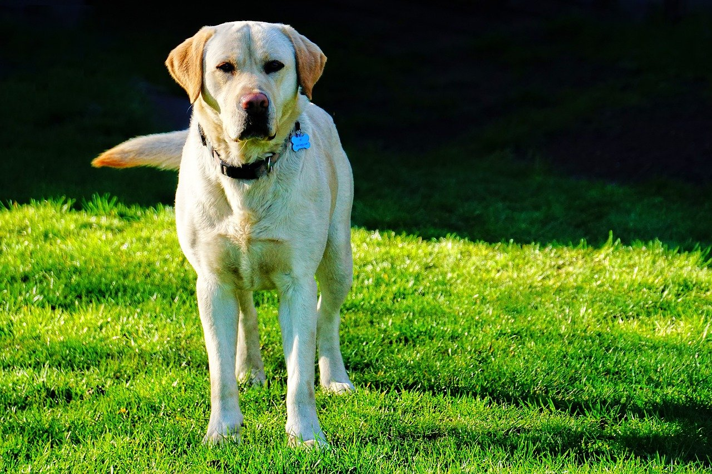

# Vision Transformer

## input


(from https://pixabay.com/photos/labrador-retriever-dog-pet-labrador-6244939/)

<br/>

## output


<br/>

## usage
Automatically downloads the onnx and prototxt files on the first run.
It is necessary to be connected to the Internet while downloading.

For the sample image,
``` bash
$ python vit.py
(ex on CPU)  $ python vit.py -e 0
(ex on BLAS) $ python vit.py -e 1
(ex on GPU)  $ python vit.py -e 2
```

If you want to specify the input image, put the image path after the `--input` option.  
You can use `--savepath` option to change the name of the output file to save.
```bash
$ python3 vit.py --input IMAGE_PATH --savepath SAVE_IMAGE_PATH
$ python3 vit.py -i IMAGE_PATH -s SAVE_IMAGE_PATH
```

By adding the `--video` option, you can input the video.
```bash
$ python3 vit.py --video VIDEO_PATH --savepath SAVE_VIDEO_PATH
$ python3 vit.py -v VIDEO_PATH -s SAVE_VIDEO_PATH
(ex) $ python3 vit.py --video input.mp4 --savepath output.mp4
```

<br/>

## Reference

[Pytorch reimplementation of the Vision Transformer (An Image is Worth 16x16 Words: Transformers for Image Recognition at Scale)](https://github.com/jeonsworld/ViT-pytorch)

<br/>

## Framework
Pytorch

<br/>

## Model Format
ONNX opset = 10

<br/>

## Netron

[ViT-B_16-224.onnx.prototxt](https://netron.app/?url=https://storage.googleapis.com/ailia-models/vit/ViT-B_16-224.onnx.prototxt)
