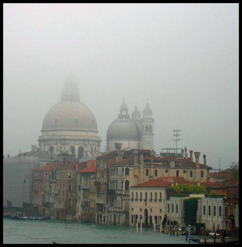

# Weather Prediction From Image - (Warmth Of Image)


(Image from https://github.com/berkgulay/weather-prediction-from-image)

### Input
- input image



(Extracted from the dataset above.)

### Output
- output image with weather class (one of "Cloudy", "Sunny", "Rainy", "Snowy", "Foggy") and probability annotated


### Usage
Automatically downloads the onnx and prototxt files on the first run.
It is necessary to be connected to the Internet while downloading.

For the sample image,
``` bash
$ python3 weather-prediction-from-image.py
```

If you want to specify the input image, put the image path after the `--input` option.  
You can use `--savepath` option to change the directory of the output file to be saved.
```bash
$ python3 weather-prediction-from-image.py --input IMAGE_PATH --savepath SAVE_IMAGE_PATH
```

By adding the `--video` option, you can input the video and convert it by the style image.
If you pass `0` as an argument to VIDEO_PATH, you can use the webcam input instead of the video file.
```bash
$ python3 weather-prediction-from-image.py --video VIDEO_PATH
```

### Framework
keras

### Model Format
ONNX opset = 11

### Reference

[Weather Prediction From Image - (Warmth Of Image)](https://github.com/berkgulay/weather-prediction-from-image)

### Netron
- [weather-prediction-from-image_trainedModelE20.onnx.prototxt](https://netron.app/?url=https://storage.googleapis.com/ailia-models/weather-prediction-from-image/weather-prediction-from-image_trainedModelE20.onnx.prototxt)
