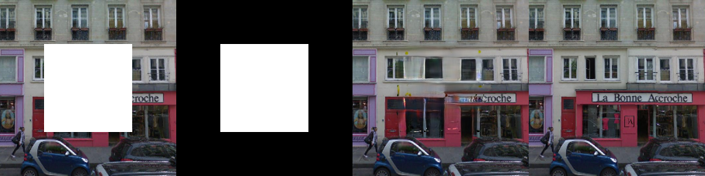

# Free-Form Image Inpainting with Gated Convolution

## Input


(Image from https://github.com/shepnerd/inpainting_gmcnn/blob/master/tensorflow/imgs/paris-streetview_256x256/001.png)

Shape : (1, 3, 256, 256)

## Output

Left to right: input, mask, image generated by the network, ground truth

### Results on Paris streetview with rectangle masks



Shape : (1, 3, 256, 256)

### Results on CelebA with rectangle masks


Shape : (1, 3, 256, 256)

### Results on CelebA with random strokes


Shape : (1, 3, 256, 256)

### Results on Places with random strokes


Shape : (1, 3, 256, 256)

## Usage

Automatically downloads the onnx and prototxt files on the first run.
It is necessary to be connected to the Internet while downloading.

For the sample image,

```bash
$ python3 deepfillv2.py
```

If you want to specify the input image, put the image path after the `--input` option.
You can use `--savepath` option to change the name of the output file to save.

```bash
$ python3 deepfillv2.py --input IMAGE_PATH --savepath SAVE_IMAGE_PATH
```

By adding the `--model` option, you can specify model type which is selected from "places", "celeba".
(default is places)
And it can specify mask type "rect" or "stroke" after the `--mask_type` option.
(default is rect)

```bash
$ python3 deepfillv2.py --model places --mask_type rect
```

For CelebA with rectangle masks.

```bash
$ python3 deepfillv2.py --model celeba -i celebahq_256x256_001.png
```

For CelebA with random strokes.

```bash
$ python3 deepfillv2.py --model celeba --mask_type stroke -i celebahq_512x512_016.png
```

For Places with random strokes.

```bash
$ python3 deepfillv2.py --model places --mask_type stroke -i places2_001.png
```

## Reference

[Free-Form Image Inpainting with Gated Convolution](https://github.com/open-mmlab/mmediting/tree/master/configs/inpainting/deepfillv2)

## Framework

Pytorch

## Model Format

ONNX opset=11

## Netron

[celeba_256x256.onnx.prototxt](https://netron.app/?url=https://storage.googleapis.com/ailia-models/deepfillv2/deepfillv2_celeba_256x256.onnx.prototxt)

[places_256x256.onnx.prototxt](https://netron.app/?url=https://storage.googleapis.com/ailia-models/deepfillv2/deepfillv2_places_256x256.onnx.prototxt)

[places_512x512.onnx.prototxt](https://netron.app/?url=https://storage.googleapis.com/ailia-models/deepfillv2/deepfillv2_places_512x512.onnx.prototxt)

[places_1024x1024.onnx.prototxt](https://netron.app/?url=https://storage.googleapis.com/ailia-models/deepfillv2/deepfillv2_places_1024x1024.onnx.prototxt)
