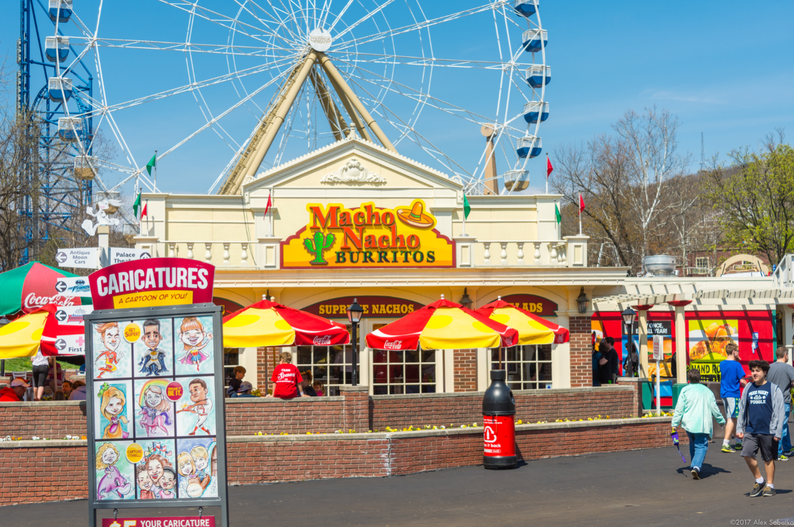
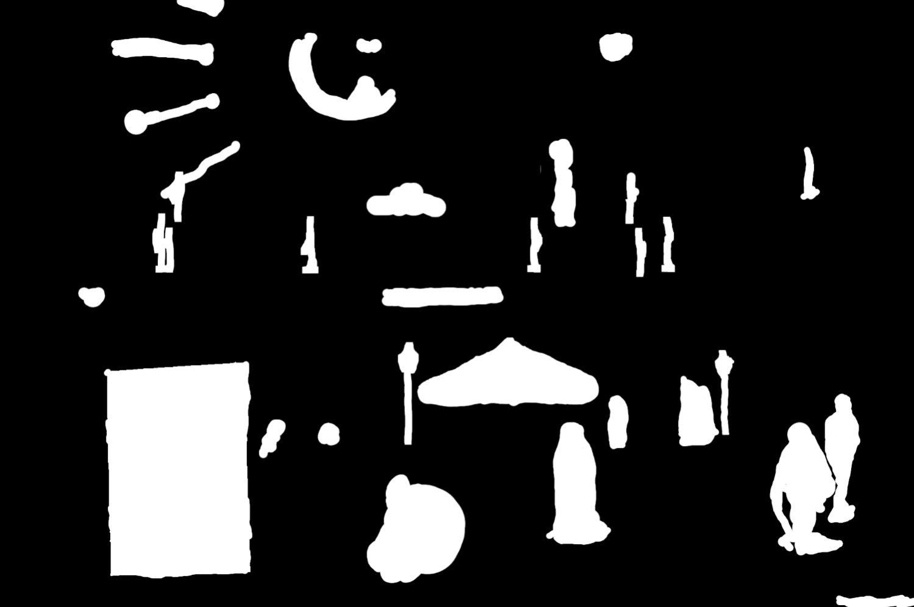
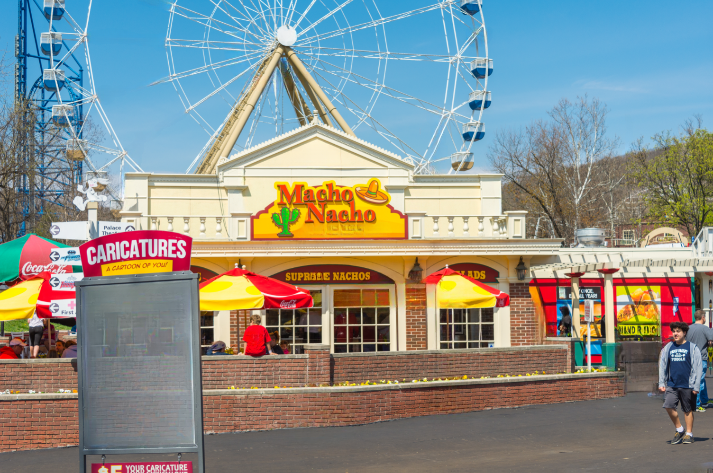

# LaMa: Resolution-robust Large Mask Inpainting with Fourier Convolutions

## Input





(Image from https://drive.google.com/drive/folders/1B2x7eQDgecTL0oh3LSIBDGj0fTxs6Ips?usp=drive_link)

Shape : (1, 3, 1499, 996)

## Output



Shape : (1, 1, 1499, 996)

## Usage

Automatically downloads the onnx and prototxt files on the first run.
It is necessary to be connected to the Internet while downloading.

For the sample image,

```bash
$ python3 lama.py
```
If you want to specify both the input image and a mask, provide their paths using the --input and --mask options.
You can use `--savepath` option to change the name of the output file to save.

```bash
$ python3 lama.py --input IMAGE_PATH --mask MASK_PATH --savepath SAVE_IMAGE_PATH
```


## Reference

[LaMa: Resolution-robust Large Mask Inpainting with Fourier Convolutions](https://github.com/advimman/lama)

## Framework

Pytorch

## Model Format

ONNX opset=17

## Netron

[lama.onnx.prototxt](https://netron.app/?url=https://storage.googleapis.com/ailia-models/lama/lama.onnx.prototxt)
