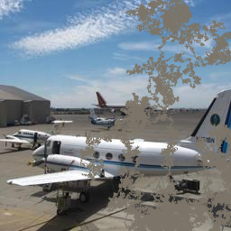

# pytorch-inpainting-with-partial-conv

## Input



(Image from Places2 dataset http://places2.csail.mit.edu/download.html)

Shape : (n, 3, 256, 256)

## Output


Left to right: input, mask, image generated by the network, ground truth

Shape : (n, 3, 256, 256)

## Usage
Automatically downloads the onnx and prototxt files on the first run.
It is necessary to be connected to the Internet while downloading.

For the sample image,
```bash
$ python3 pytorch-inpainting-with-partial-conv.py
```

If you want to specify the input image, put the image path after the `--input` option.  
You can use `--savepath` option to change the name of the output file to save.
```bash
$ python3 pytorch-inpainting-with-partial-conv.py --input IMAGE_PATH --savepath SAVE_IMAGE_PATH
```

By adding the `--mask-index` option, you can specify index of mask file.  
(default is randomly selected)

```bash
$ python3 pytorch-inpainting-with-partial-conv.py --mask-index 12
```

If you want to re-generate mask file, run generate_masks.py.  
You can specify the number of files to generate by `--N` option.
```bash
$ python3 generate_masks.py --N 16
```

## Reference

[pytorch-inpainting-with-partial-conv](https://github.com/naoto0804/pytorch-inpainting-with-partial-conv)

## Framework

Pytorch

## Model Format

ONNX opset=11

## Netron

[partialconv.onnx.prototxt](https://netron.app/?url=https://storage.googleapis.com/ailia-models/pytorch-inpainting-with-partial-conv/partialconv.onnx.prototxt)
