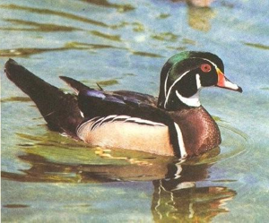

# CNNGeometric PyTorch implementation

Convolutional neural network architecture for geometric matching

## Input

Source input image    
    

Target input image    


(Images above are from [PF-WILLOW dataset](http://www.di.ens.fr/willow/research/proposalflow/dataset/PF-dataset.zip). Web site url is https://www.di.ens.fr/willow/research/proposalflow/)

## Output
Output image   


## Usage
Automatically downloads the onnx and prototxt files on the first run.
It is necessary to be connected to the Internet while downloading.

For the sample image and default model (streetview_affine),
```
$ python3 cnngeometric_pytorch.py
```

If you want to specify the input image, put the image path after the `--input` option.  
You can use `--savepath` option to change the name of the output file to save.
```
$ python3 cnngeometric_pytorch.py --input IMAGE_PATH --savepath SAVE_IMAGE_PATH
```

By adding the `--video` option, you can input the video.   
If you pass `0` as an argument to VIDEO_PATH, you can use the webcam input instead of the video file.
```
$ python3 cnngeometric_pytorch.py --video VIDEO_PATH
```

If you want to change model type, use `--model_1` option.    
```
$ python3 cnngeometric_pytorch.py --model_1 MODEL_NAME
```

Furthermore, you can predict in two stages by adding `--model_2` option.
```
$ python3 cnngeometric_pytorch.py --model_1 MODEL_NAME --model_2 MODEL_NAME
```

If you want to predict iteratively, use `--num_of_iter` option.
```
$ python3 cnngeometric_pytorch.py --num_of_iter ITER_NUM
```

The followings are example commands.
```
$ python3 cnngeometric_pytorch.py --model_1 streetview_affine --num_of_iter 3

$ python3 cnngeometric_pytorch.py --model_1 streetview_affine --model_2 streetview_tps --num_of_iter 1

$ python3 cnngeometric_pytorch.py --model_1 streetview_affine --model_2 streetview_tps --num_of_iter 2 --input input_source.png --input_tgt input_target.png --savepath sample.png

$ python3 cnngeometric_pytorch.py --model_1 streetview_affine --num_of_iter 3 --video ex1.mp4 --video_tgt ex2.mp4 --savepath output.mov
```

## Reference

- [CNNGeometric PyTorch implementation](https://github.com/ignacio-rocco/cnngeometric_pytorch)

## Framework

PyTorch

## Model Format

ONNX opset=11

## Netron

[streetview_affine.onnx.prototxt](https://netron.app/?url=https://storage.googleapis.com/ailia-models/cnngeometric_pytorch/streetview_affine.onnx.prototxt)    
[streetview_hom.onnx.prototxt](https://netron.app/?url=https://storage.googleapis.com/ailia-models/cnngeometric_pytorch/streetview_hom.onnx.prototxt)    
[streetview_tps.onnx.prototxt](https://netron.app/?url=https://storage.googleapis.com/ailia-models/cnngeometric_pytorch/streetview_tps.onnx.prototxt)
