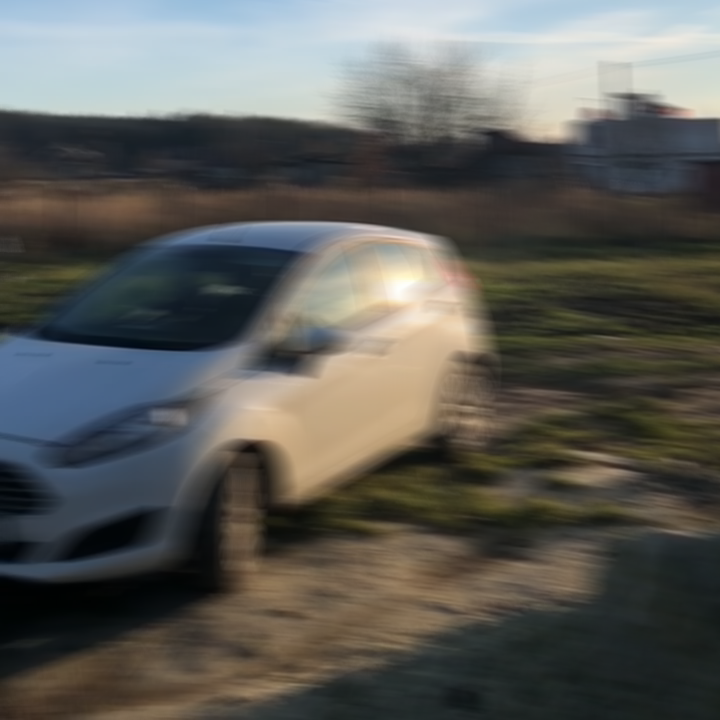

# DeblurGAN

## Input



(Image from https://drive.google.com/file/d/1CPMBmRj-jBDO2ax4CxkBs9iczIFrs8VA/view?usp=sharing)

## Output


## Usage

Automatically downloads the onnx and prototxt files on the first run.
It is necessary to be connected to the Internet while downloading.

For the sample image,

``` bash
$ python3 deblur_gan.py
```

If you want to specify the input image, put the image path after the `--input` option.  
You can use `--savepath` option to change the name of the output file to save.

```bash
$ python3 deblur_gan.py --input IMAGE_PATH --savepath SAVE_IMAGE_PATH
```

## Reference

- [DeblurGAN](https://github.com/KupynOrest/DeblurGAN)

## Framework

Pytorch

## Model Format

ONNX opset=11

## Netron

[net_G.onnx.prototxt](https://netron.app/?url=https://storage.googleapis.com/ailia-models/deblur_gan/net_G.onnx.prototxt)
