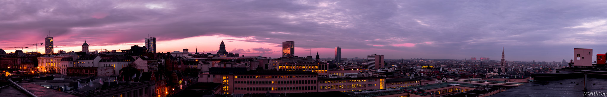
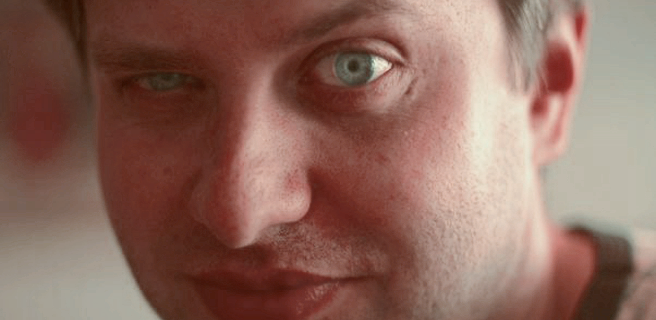
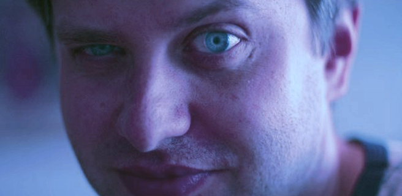

# Deep White-Balance

## Input


(from https://github.com/mahmoudnafifi/Deep_White_Balance/tree/master/example_images)

Ailia input shape: (1, 3, 320, 656)

## Output
### output_AWB (AWB)

### output_S (Shade WB)

### output_T (Tungsten WB)



### Note

This Software is licensed under the Attribution-NonCommercial-ShareAlike 4.0 International.

## Usage
Automatically downloads the onnx and prototxt files on the first run.
It is necessary to be connected to the Internet while downloading.

For the sample image,
``` bash
python3 deep_white_balance.py 
```

If you want to specify the input image, put the image path after the `--input` option.  
You can use `--savepath` option to change the name of the output file to save.
```bash
$ python3 deep_white_balance.py --input IMAGE_PATH --savepath SAVE_IMAGE_PATH
```

By adding the `--video` option, you can input the video. 
If you pass `0` as an argument to VIDEO_PATH, you can use the webcam input instead of the video file.
```bash
$ python3 deep_white_balance.py --video VIDEO_PATH
```

## Reference
[Deep White-Balance Editing, CVPR 2020 (Oral)](https://github.com/mahmoudnafifi/Deep_White_Balance)

## Framework
PyTorch 1.5.0

## Model Format
ONNX opset = 10

## Netron

[net_awb.onnx.prototxt](https://netron.app/?url=https://storage.googleapis.com/ailia-models/deep_white_balance/net_awb.onnx.prototxt)

[net_t.onnx.prototxt](https://netron.app/?url=https://storage.googleapis.com/ailia-models/deep_white_balance/net_t.onnx.prototxt)

[net_s.onnx.prototxt](https://netron.app/?url=https://storage.googleapis.com/ailia-models/deep_white_balance/net_s.onnx.prototxt)

