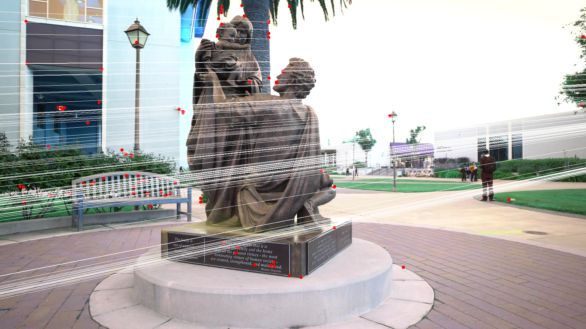

# Deep Fundamental Matrix Estimation

## Input

- img_A


- img_B


(Images from https://www.pexels.com/ja-jp/video/854669/)

## Output

- Epipolar line for img_A


- Epipolar line for img_B



## Usage
Automatically downloads the onnx and prototxt files on the first run.
It is necessary to be connected to the Internet while downloading.

For the sample image,
```bash
$ python3 dfe.py
```

If you want to specify the input image, put the image path (as img_B) after the `--input` option, 
and the second image path (as img_A) after the `--input2` option.  
```bash
$ python3 dfe.py --input IMAGE_B --input2 IMAGE_A
```

## Reference

- [Deep Fundamental Matrix Estimation - CVF Open Access](https://openaccess.thecvf.com/content_ECCV_2018/papers/Rene_Ranftl_Deep_Fundamental_Matrix_ECCV_2018_paper.pdf)

- [Deep Fundamental Matrix Estimation](https://github.com/isl-org/DFE)

- [pytorch-deepFEPE](https://github.com/eric-yyjau/pytorch-deepFEPE)
    - A part of feature extraction by using SIFT. 

## Framework

Pytorch

## Model Format

ONNX opset=11

## Netron

[WeightEstimatorNet_init.onnx.prototxt](https://netron.app/?url=https://storage.googleapis.com/ailia-models/dfe/WeightEstimatorNet_init.onnx.prototxt)

[WeightEstimatorNet_iter.onnx.prototxt](https://netron.app/?url=https://storage.googleapis.com/ailia-models/dfe/WeightEstimatorNet_iter.onnx.prototxt)
