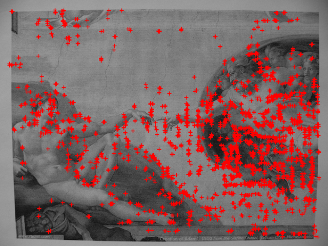
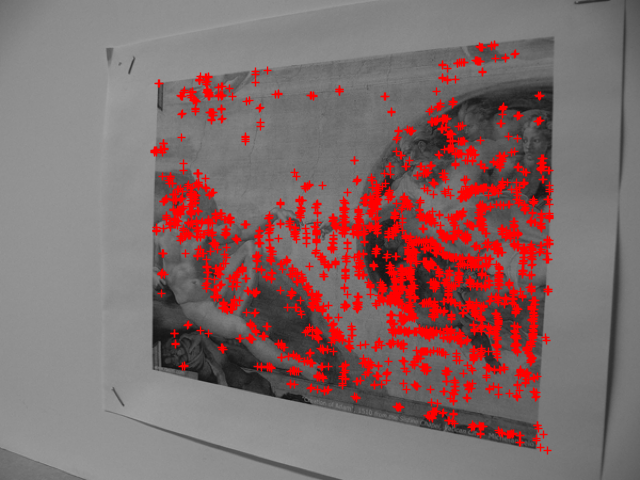

# DFM: A Performance Baseline for Deep Feature Matching

## Input

- img_A


- img_B


(Image from https://github.com/ufukefe/DFM/tree/main/python/data)

## Output

- Matches result


- Plot keypoints for img_A



- Plot keypoints for img_B



## Caution
The software can only be used for personal, research, academic and non-commercial purposes.

## Usage
Automatically downloads the onnx and prototxt files on the first run.
It is necessary to be connected to the Internet while downloading.

For the sample image,
```bash
$ python3 dfm.py
```

If you want to specify the input image, put the image path (as img_B) after the `--input` option, 
and the second image path (as img_A) after the `--input2` option.  
You can use `--savepath` option to change the name of the output file to save.
```bash
$ python3 dfm.py --input IMAGE_B --input2 IMAGE_A --savepath SAVE_IMAGE_PATH
```

Use the `--draw-keypoints` option to save plot results of keypoints.
```bash
$ python3 dfm.py --draw-keypoints
```

## Reference

- [DFM](https://github.com/ufukefe/DFM)

## Framework

Pytorch

## Model Format

ONNX opset=11

## Netron

[VGG19.onnx.prototxt](https://netron.app/?url=https://storage.googleapis.com/ailia-models/dfm/VGG19.onnx.prototxt)
