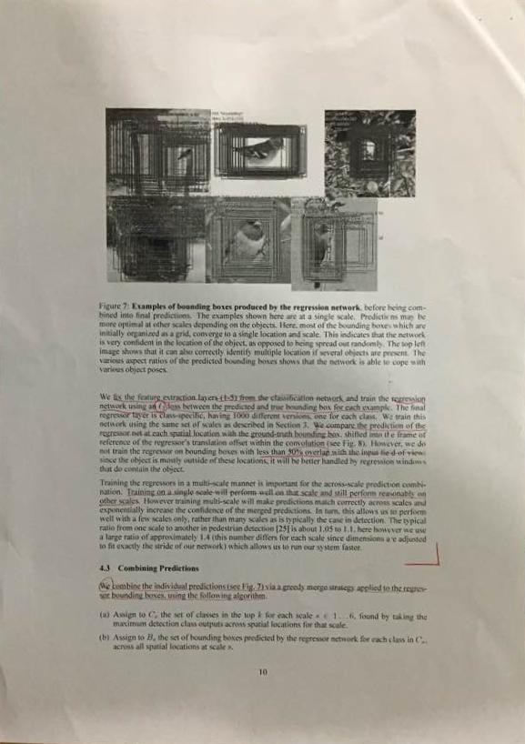
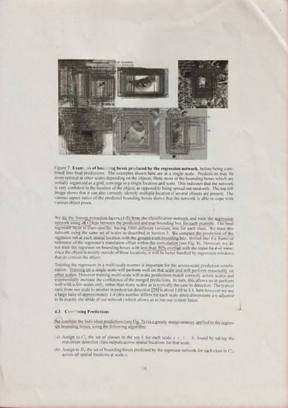

# DocShadow-SD7K

## Input



(Image from https://github.com/fabio-sim/DocShadow-ONNX-TensorRT/blob/main/assets/sample.jpg)

Ailia input shape : (1, 3, IMAGE_HEIGHT, IMAGE_WIDTH)  

## Output



Ailia output shape : (1, 3, IMAGE_HEIGHT , IMAGE_WIDTH)


## Usage
Automatically downloads the onnx and prototxt files when running.
It is necessary to be connected to the Internet while downloading.

For the sample image with twice the resolution,
``` bash
$ python3 docshadow.py
```

If you want to specify the input image, put the image path after the `--input` option.  
You can use `--savepath` option to change the name of the output file to save.
```bash
$ python3 docshadow.py --input IMAGE_PATH --savepath SAVE_IMAGE_PATH
```

By adding the `--video` option, you can input the video.   
If you pass `0` as an argument to VIDEO_PATH, you can use the webcam input instead of the video file.

```bash
$ python3 docshadow.py --video VIDEO_PATH
```


## Reference

[DocShadow-ONNX-TensorRT](https://github.com/fabio-sim/DocShadow-ONNX-TensorRT)

## Framework

Pytorch 2.0.1

## Model Format

ONNX opset = 12

## Netron

[docshadow_sd7k.onnx.prototxt](https://netron.app/?url=https://storage.googleapis.com/ailia-models/docshadow/docshadow_sd7k.onnx.prototxt)

[docshadow_jung.onnx.prototxt](https://netron.app/?url=https://storage.googleapis.com/ailia-models/docshadow/docshadow_jung.onnx.prototxt)

[docshadow_kligler.onnx.prototxt](https://netron.app/?url=https://storage.googleapis.com/ailia-models/docshadow/docshadow_kligler.onnx.prototxt)

