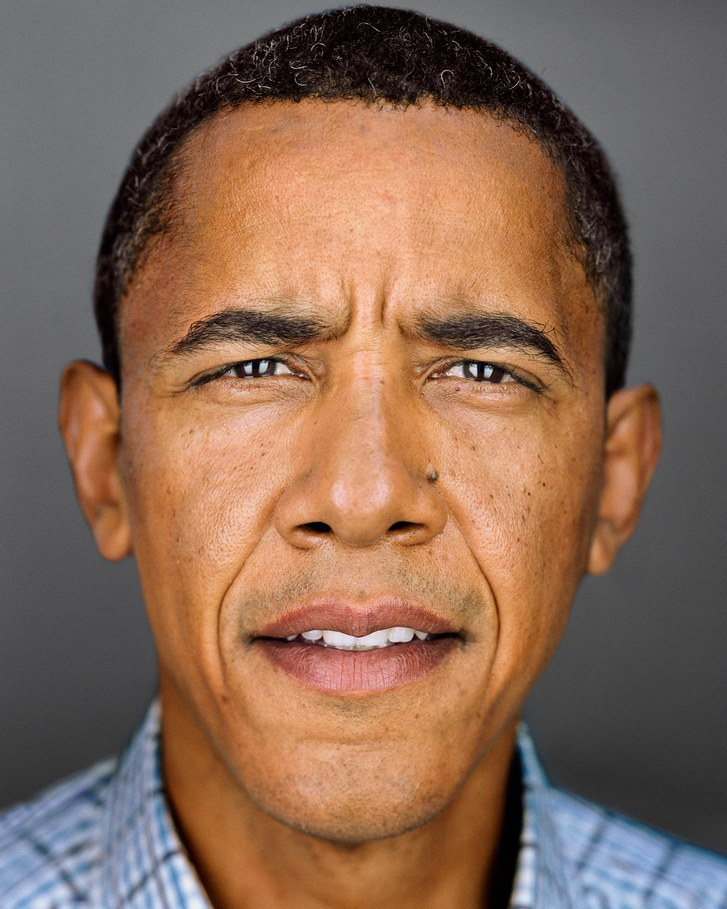
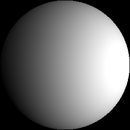
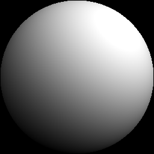
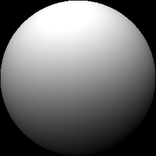
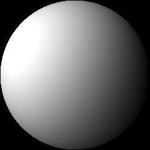
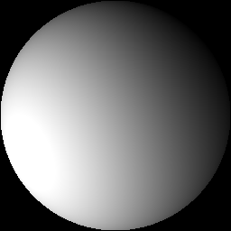
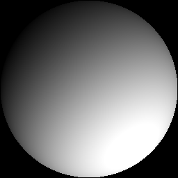

# Deep Single-Image Portrait Relighting

## Input



(Image from https://github.com/zhhoper/DPR/blob/master/data/obama.jpg)

### model_type : 512
- x shape : (1, 1, 512, 512)
- target_light shape : (1, 9, 1, 1)

### model_type : 1024
- x shape : (1, 1, 1024, 1024)
- target_light shape : (1, 9, 1, 1)

## Output

<p>


</p>
<p>







</p>

### model_type : 512
- out_l shape : (1, 1, 512, 512)
- out_light shape : (1, 9, 1, 1)

### model_type : 1024
- out_l shape : (1, 1, 1024, 1024)
- out_feat shape : (1, 128, 32, 32)
- out_light shape : (1, 9, 1, 1)

## Usage
Automatically downloads the onnx and prototxt files on the first run.
It is necessary to be connected to the Internet while downloading.

For the sample image,
``` bash
$ python3 dpr.py
```

If you want to specify the input image, put the image path after the `--input` option.  
You can use `--savepath` option to change the name of the output file to save.
```bash
$ python3 dpr.py --input IMAGE_PATH --savepath SAVE_IMAGE_PATH
```

By adding the `--video` option, you can input the video.   
If you pass `0` as an argument to VIDEO_PATH, you can use the webcam input instead of the video file.
```bash
$ python3 dpr.py --video VIDEO_PATH
```

By adding the `--model_type` option, you can specify model type which is selected from "512", "1024". (default is 512)
```bash
$ python3 dpr.py --model_type 512
```

You can use `-sh` option to specify the "SH (Spherical Harmonics) lighting" file or the directory where the file is located.  
(default is lighting/rotate_light_00.txt)
```bash
$ python3 dpr.py -sh lighting/rotate_light_00.txt
```

Render the half-sphere image using the `--shading` option.
```bash
$ python3 dpr.py --shading
```

## Reference

- [Deep Single-Image Portrait Relighting](https://github.com/zhhoper/DPR)

## Framework

Pytorch

## Model Format

ONNX opset=11

## Netron

[trained_model_03.onnx.prototxt](https://netron.app/?url=https://storage.googleapis.com/ailia-models/dpr/trained_model_03.onnx.prototxt)  
[trained_model_1024_03.onnx.prototxt](https://netron.app/?url=https://storage.googleapis.com/ailia-models/dpr/trained_model_1024_03.onnx.prototxt)
