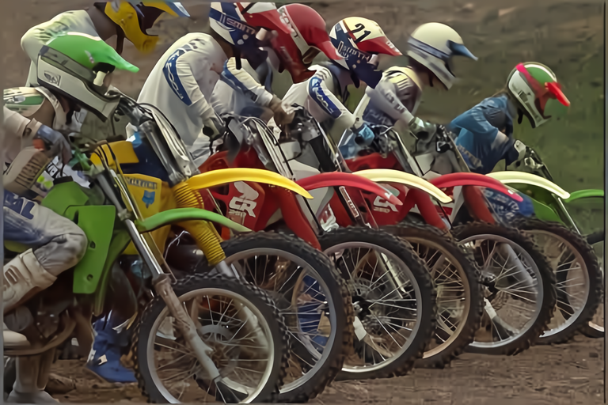
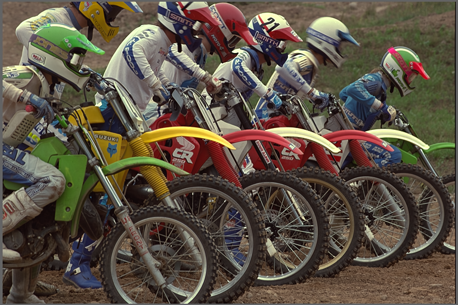
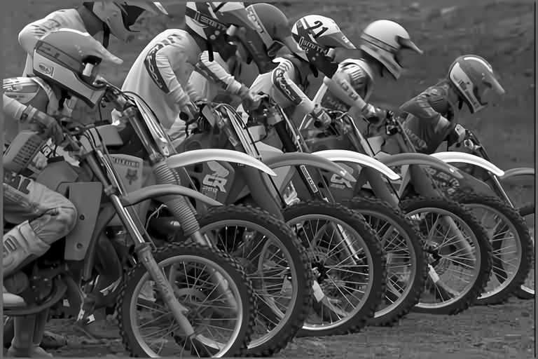
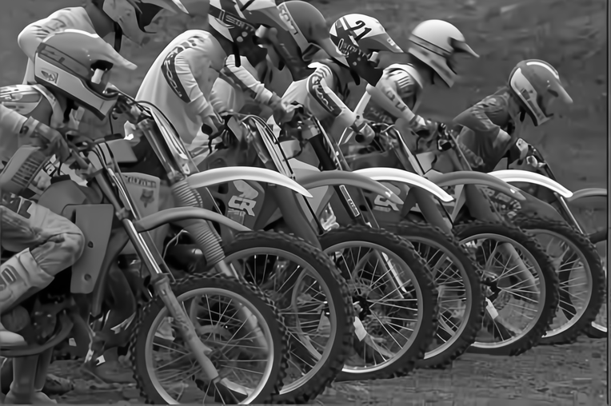

# FBCNN : Towards Flexible Blind JPEG Artifacts Removal

## Input


(from https://live.ece.utexas.edu/research/quality/)

Ailia input shape: (1, 3, 256, 256)  
Range: [0, 1]

## Output
Model 1: color(default)  


Model 2: color_real    


Model 3: gray    


Model 4: gray_doublejpeg    


## Usage
Automatically downloads the onnx and prototxt files on the first run.
It is necessary to be connected to the Internet while downloading.

For the sample image,
``` bash
python3 fbcnn.py
```
In the above, model is `color`, input image is `input.bmp` and output image is `output.bmp`.

If you want to specify the input image, put the image path after the `--input` option.  
You can use `--savepath` option to change the name of the output file to save.    
Furthermore, you can use `--model` option to change the model and choose model name from `[color, color_real, gray, gray_doublejpeg]`.
```bash
$ python3 fbcnn.py --model MODEL_NAME --input IMAGE_PATH --savepath SAVE_IMAGE_PATH
```

By adding the `--video` option, you can input the video.
If you pass `0` as an argument to VIDEO_PATH, you can use the webcam input instead of the video file.
```bash
$ python3 fbcnn.py --model MODEL_NAME --video VIDEO_PATH --savepath SAVE_VIDEO_PATH

```

## Reference
Paper: [Towards Flexible Blind JPEG Artifacts Removal (FBCNN, ICCV 2021)](https://arxiv.org/pdf/2109.14573.pdf)    
Github: [jiaxi-jiang/FBCNN](https://github.com/jiaxi-jiang/FBCNN)    
Dataset: [Laboratory for Image & Video Engineering](https://live.ece.utexas.edu/research/quality/)

## Framework
PyTorch 1.7.1

## Model Format
ONNX opset = 10

## Netron

[fbcnn_color.onnx.prototxt](https://netron.app/?url=https://storage.googleapis.com/ailia-models/fbcnn/fbcnn_color.onnx.prototxt)    
[fbcnn_color_real.onnx.prototxt](https://netron.app/?url=https://storage.googleapis.com/ailia-models/fbcnn/fbcnn_color_real.onnx.prototxt)    
[fbcnn_gray.onnx.prototxt](https://netron.app/?url=https://storage.googleapis.com/ailia-models/fbcnn/fbcnn_gray.onnx.prototxt)    
[fbcnn_gray_doublejpeg.onnx.prototxt](https://netron.app/?url=https://storage.googleapis.com/ailia-models/fbcnn/fbcnn_gray_doublejpeg.onnx.prototxt)
