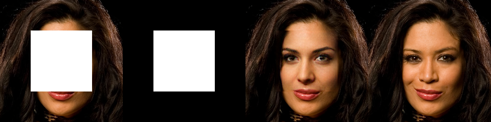

# Image Inpainting via Generative Multi-column Convolutional Neural Networks

## Input


(Image from https://github.com/shepnerd/inpainting_gmcnn/blob/master/tensorflow/imgs/paris-streetview_256x256/001.png)

Shape : (1, 256, 256, 3)

## Output

Left to right: input, mask, image generated by the network, ground truth


### Results on Paris streetview with rectangle masks


Shape : (1, 256, 256, 3)

### Results on CelebA-HQ with rectangle masks



Shape : (1, 512, 512, 3)

### Results on CelebA-HQ with random strokes


Shape : (1, 512, 512, 3)

### Results on Places2 with random strokes


Shape : (1, 512, 680, 3)

## Usage
Automatically downloads the onnx and prototxt files on the first run.
It is necessary to be connected to the Internet while downloading.

For the sample image,
```bash
$ python3 inpainting_gmcnn.py
```

If you want to specify the input image, put the image path after the `--input` option.  
You can use `--savepath` option to change the name of the output file to save.
```bash
$ python3 inpainting_gmcnn.py --input IMAGE_PATH --savepath SAVE_IMAGE_PATH
```

By adding the `--model` option, you can specify model type which is selected from "paris-streetview", "celebahq", "celebahq-512", "places2".  
(default is paris-streetview)  
And it can specify mask type "rect" or "stroke" after the `--mask-type` option.  
(default is paris-streetview)
```bash
$ python3 inpainting_gmcnn --model paris-streetview --mask_type rect
```

For CelebA-HQ with rectangle masks.
```bash
$ python3 inpainting_gmcnn.py --model celebahq -i celebahq_256x256_001.png
```

For CelebA-HQ with random strokes.
```bash
$ python3 inpainting_gmcnn.py --model celebahq-512 --mask_type stroke -i celebahq_512x512_016.png
```

For Places2 with random strokes.
```bash
$ python3 inpainting_gmcnn.py --model places2 --mask_type stroke -i places2_001.png
```

## Reference

[Image Inpainting via Generative Multi-column Convolutional Neural Networks](https://github.com/naoto0804/pytorch-inpainting-with-partial-conv)

## Framework

TensorFlow

## Model Format

ONNX opset=11

## Netron

[paris-streetview_256x256_rect.onnx.prototxt](https://netron.app/?url=https://storage.googleapis.com/ailia-models/inpainting_gmcnn/paris-streetview_256x256_rect.onnx.prototxt)
[celebahq_256x256_rect.onnx.prototxt](https://netron.app/?url=https://storage.googleapis.com/ailia-models/inpainting_gmcnn/celebahq_256x256_rect.onnx.prototxt)
[celebahq_512x512_rect.onnx.prototxt](https://netron.app/?url=https://storage.googleapis.com/ailia-models/inpainting_gmcnn/celebahq_512x512_rect.onnx.prototxt)
[celebahq_512x512_freeform.onnx.prototxt](https://netron.app/?url=https://storage.googleapis.com/ailia-models/inpainting_gmcnn/celebahq_512x512_freeform.onnx.prototxt)
[places2_512x680_freeform.onnx.prototxt](https://netron.app/?url=https://storage.googleapis.com/ailia-models/inpainting_gmcnn/places2_512x680_freeform.onnx.prototxt)