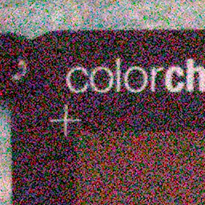

# Invertible Denoising Network

## Input



(Image from https://www.eecs.yorku.ca/~kamel/sidd/benchmark.php)

input image/video size 256×256

## Output


output image/video size 256×256

### usage
Automatically downloads the onnx and prototxt files on the first run.
It is necessary to be connected to the Internet while downloading.

If you predict denoised image, you specify `--input` option as below.  
``` bash
python3 invertible_denoising_network.py -i input.png
```

If you predict denoised video, you specify `--video` option as below. Please be careful that an input video is noised at first and the model denoised this.    
``` bash
python3 invertible_denoising_network.py -v input.mp4
```

## Reference
- Repository    
[Invertible Image Denoising](https://github.com/Yang-Liu1082/InvDN)

- Input images    
SIDD Benchmark > Download > SIDD Benchmark Data > Noisy sRGB data    
[Smartphone Image Denoising Dataset](https://www.eecs.yorku.ca/~kamel/sidd/benchmark.php)

## Framework

Pytorch 1.5.0

## Model Format

ONNX opset = 11

## Netron

[InvDN.onnx.prototxt](https://netron.app/?url=https://storage.googleapis.com/ailia-models/invertible_denoising_network/InvDN.onnx.prototxt)
