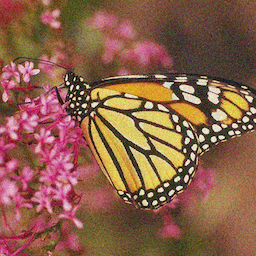

# Noise2Noise

## Input



Ailia input shape : (1,3,256,256)  
Range : [0.0, 1.0]

## Output


### usage
Automatically downloads the onnx and prototxt files on the first run.
It is necessary to be connected to the Internet while downloading.

For the sample image,
``` bash
$ python3 noise2noise.py
```

If you want to specify the input image, put the image path after the `--input` option.  
You can use `--savepath` option to change the name of the output file to save.
```bash
$ python3 noise2noise.py --input IMAGE_PATH --savepath SAVE_IMAGE_PATH
```

By adding the `--video` option, you can input the video.   
If you pass `0` as an argument to VIDEO_PATH, you can use the webcam input instead of the video file.
```bash
$ python3 noise2noise.py --video VIDEO_PATH
```

If you want to try this model on a normal image, `--add_noise` will automatically add noise to the image before loading it.
The noise-added image will be saved as `noise_image.png` in the current directory.


## Reference

[Learning Image Restoration without Clean Data](https://github.com/joeylitalien/noise2noise-pytorch)

## Framework

Pytorch 1.2.0

## Model Format

ONNX opset = 10

## Netron

[noise2noise_gaussian.onnx.prototxt](https://netron.app/?url=https://storage.googleapis.com/ailia-models/noise2noise/noise2noise_gaussian.onnx.prototxt)

