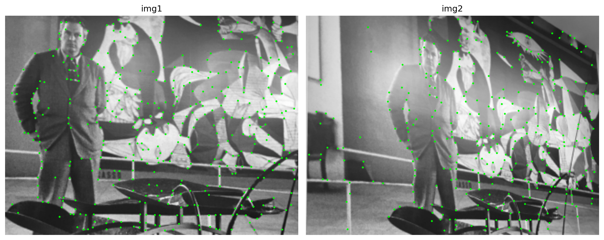
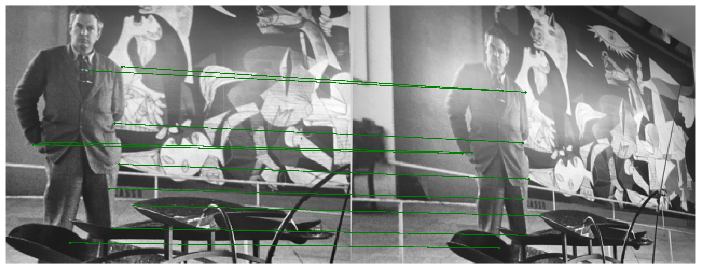
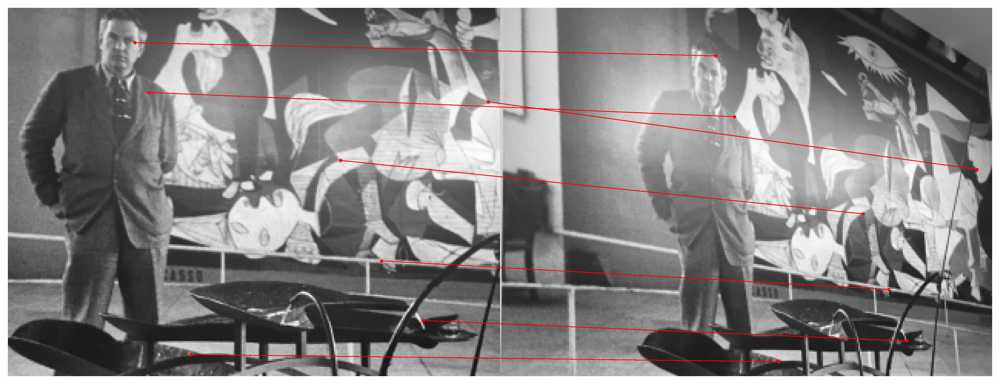
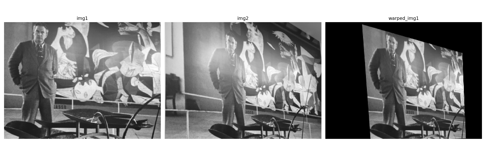
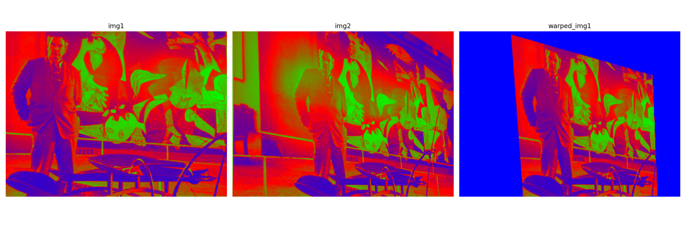

# pytorch-superpoint

## Input

- img_A


- img_B


(Image from http://icvl.ee.ic.ac.uk/vbalnt/hpatches/hpatches-sequences-release.tar.gz)

## Output

- Keypoints result



- Matches result (inliers)



- Matches result (outliers)



- Warping result (gray)



- Warping result (filterd)



- Warping result (correspondence)


## Usage
Automatically downloads the onnx and prototxt files on the first run.
It is necessary to be connected to the Internet while downloading.

For the sample image,
```bash
$ python3 pytorch_superpoint.py
```

If you want to specify the input image, put the image path (as img_B) after the `--input` option, 
and the second image path (as img_A) after the `--input2` option.  
```bash
$ python3 pytorch_superpoint.py
 --input IMAGE_B --input2 IMAGE_A
```

## Reference

- [pytorch-superpoint](https://github.com/eric-yyjau/pytorch-superpoint)

- [SuperPoint: Self-Supervised Interest Point Detection and Description](https://arxiv.org/pdf/1712.07629.pdf)

## Framework

Pytorch

## Model Format

ONNX opset=11

## Netron

[SuperPointNet_gauss2.onnx.prototxt](https://netron.app/?url=https://storage.googleapis.com/ailia-models/pytorch-superpoint/SuperPointNet_gauss2.onnx.prototxt)
