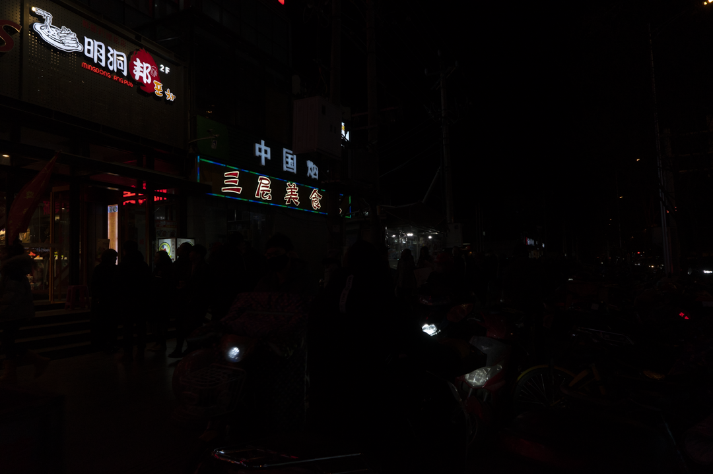
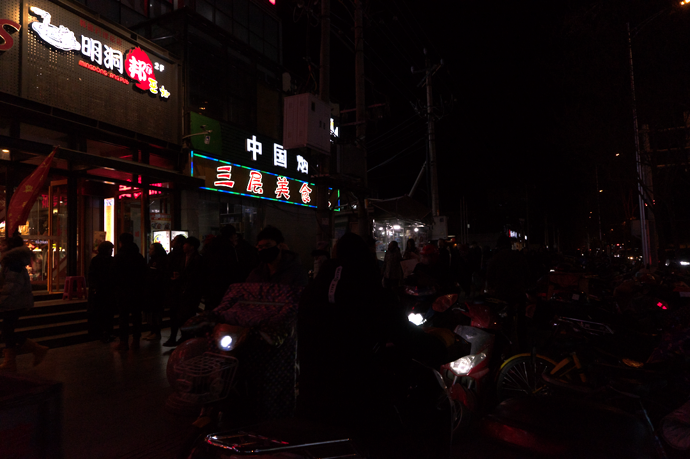
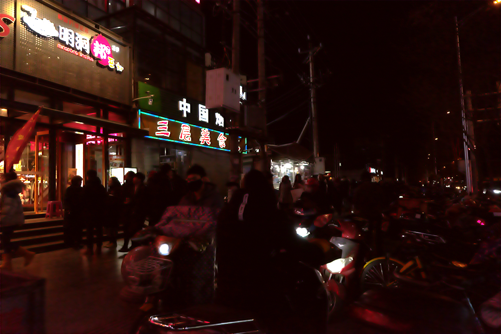
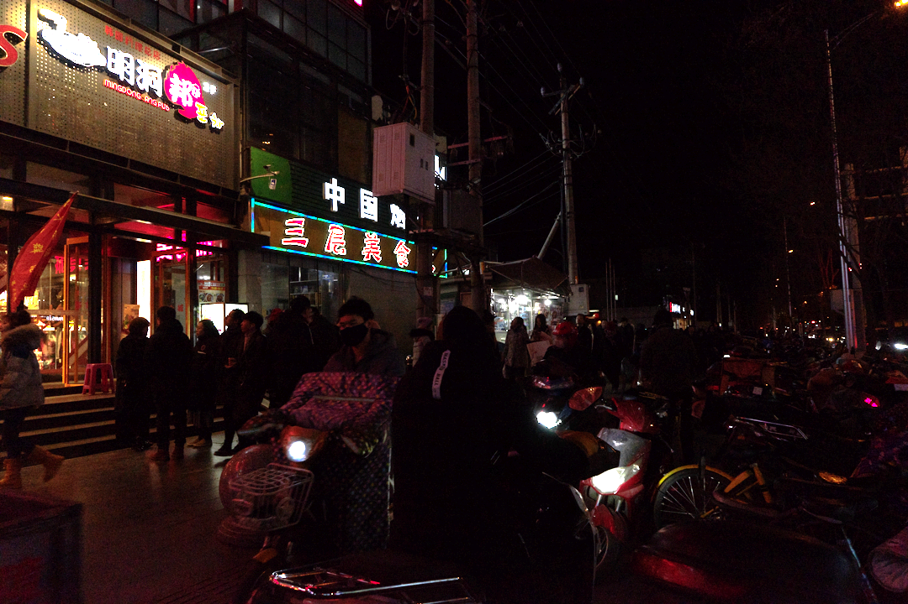

# RUAS

## Input


(Image from https://flyywh.github.io/CVPRW2019LowLight/)

Ailia input shape: (1, 3, 720, 1080)

## Output
### model1: UPE (trained from MIT5K dataset)

### model2: LOL (trained from LOL dataset)

### model3: DARK (trained from DarkFace dataset)



## Usage
Automatically downloads the onnx and prototxt files on the first run.
It is necessary to be connected to the Internet while downloading.

For the sample image,
``` bash
$ python3 ruas.py
```

After you run above, input(input/0.png) is passed and output(/output/upe_0.png) is generated.

If you want to specify the input image and the model, put the image path after the `--input` option and put the model name after `--model` option.
```bash
$ python3 ruas.py --input input/0.png --model upe
```
```bash
$ python3 ruas.py --input input/10.png --model lol
```
```bash
$ python3 ruas.py --input input/20.png --model dark
```

By adding the `--video` option, you can input the video.
If you pass `0` as an argument to VIDEO_PATH, you can use the webcam input instead of the video file.
```bash
$ python3 ruas.py --video VIDEO_PATH --model MODEL_NAME
```

## Reference
[RUAS](https://github.com/KarelZhang/RUAS)     
[Retinex-inspired Unrolling with Cooperative Prior Architecture Search
for Low-light Image Enhancement](https://arxiv.org/pdf/2012.05609.pdf)

## Framework
Pytorch 1.7.1

## Model Format
ONNX opset = 10

## Netron

[ruas_upe.onnx.prototxt](https://netron.app/?url=https://storage.googleapis.com/ailia-models/ruas/ruas_upe.onnx.prototxt)    
[ruas_lol.onnx.prototxt](https://netron.app/?url=https://storage.googleapis.com/ailia-models/ruas/ruas_lol.onnx.prototxt)    
[ruas_dark.onnx.prototxt](https://netron.app/?url=https://storage.googleapis.com/ailia-models/ruas/ruas_dark.onnx.prototxt)
