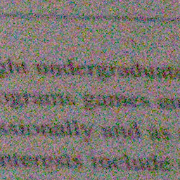
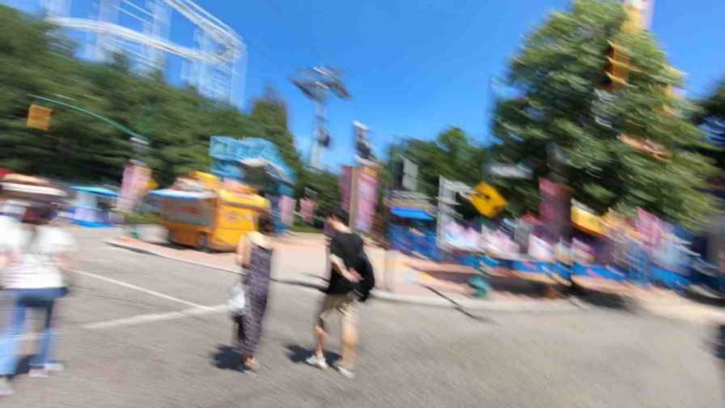

# NAFNet

## denoising

### Input



(Image from https://github.com/megvii-research/NAFNet/blob/main/demo/denoise_img.png)

Ailia input shape : (1, 3, IMAGE_HEIGHT, IMAGE_WIDTH)  

### Output


Ailia output shape : (1, 3, IMAGE_HEIGHT, IMAGE_WIDTH)

### Usage
Automatically downloads the onnx and prototxt files when running.
It is necessary to be connected to the Internet while downloading.

For the sample image with twice the resolution,
``` bash
$ python3 nafnet.py
```

If you want to specify the input image, put the image path after the `--input` option.  
You can use `--savepath` option to change the name of the output file to save.
```bash
$ python3 nafnet.py --input IMAGE_PATH --savepath SAVE_IMAGE_PATH
```

By adding the `--arch` option, you can specify architecture type which is selected from 'Baseline-SIDD-width32', 'NAFNet-SIDD-width64', 'Baseline-SIDD-width64' ,'NAFNet-SIDD-width32' ,(default is NAFNet-SIDD-width32)

```bash
$ python3 nafnet.py --arch NAFNet-SIDD-width32
```

By adding the `--video` option, you can input the video.   
If you pass `0` as an argument to VIDEO_PATH, you can use the webcam input instead of the video file.

```bash
$ python3 nafnet.py --video VIDEO_PATH
```


## deblurring


### Input



(Image from https://github.com/megvii-research/NAFNet/blob/main/demo/denoise_img.png)

Ailia input shape : (1, 3, IMAGE_HEIGHT, IMAGE_WIDTH)  

### Output


Ailia output shape : (1, 3, IMAGE_HEIGHT, IMAGE_WIDTH)

### Usage
Automatically downloads the onnx and prototxt files when running.
It is necessary to be connected to the Internet while downloading.


For the sample image with twice the resolution,
``` bash
$ python3 nafnet.py --arch NAFNet-REDS-width64
```

If you want to specify the input image, put the image path after the `--input` option.  
You can use `--savepath` option to change the name of the output file to save.
```bash
$ python3 nafnet.py --input IMAGE_PATH --savepath SAVE_IMAGE_PATH --arch NAFNet-REDS-width64
```

By adding the `--arch` option, you can specify architecture type which is selected from 'Baseline-GoPro-width32' ,'NAFNet-GoPro-width32', 'NAFNet-REDS-width64', 'Baseline-GoPro-width64','NAFNet-GoPro-width64'

```bash
$ python3 nafnet.py --arch NAFNet-REDS-width64
```

By adding the `--video` option, you can input the video.   
If you pass `0` as an argument to VIDEO_PATH, you can use the webcam input instead of the video file.

```bash
$ python3 nafnet.py --video VIDEO_PATH --arch NAFNet-REDS-width64
```


## Reference

[NAFNet](https://github.com/megvii-research/nafnet)

## Framework

Pytorch

## Model Format

ONNX opset=11

## Netron


[Baseline-GoPro-width32.onnx.prototxt](https://netron.app/?url=https://storage.googleapis.com/ailia-models/nafnet/Baseline-GoPro-width32.onnx.prototxt)  

[Baseline-GoPro-width64.onnx.prototxt](https://netron.app/?url=https://storage.googleapis.com/ailia-models/nafnet/Baseline-GoPro-width64onnx.prototxt)  

[Baseline-SIDD-width32.onnx.prototxt](https://netron.app/?url=https://storage.googleapis.com/ailia-models/nafnet/Baseline-SIDD-width32.onnx.prototxt)  

[Baseline-SIDD-width64.onnx.prototxt](https://netron.app/?url=https://storage.googleapis.com/ailia-models/nafnet/Baseline-SIDD-width64.onnx.prototxt)  

[NAFNet-GoPro-width32.onnx.prototxt](https://netron.app/?url=https://storage.googleapis.com/ailia-models/nafnet/NAFNet-GoPro-width32.onnx.prototxt)  

[NAFNet-GoPro-width64.onnx.prototxt](https://netron.app/?url=https://storage.googleapis.com/ailia-models/nafnet/NAFNet-GoPro-width64.onnx.prototxt)  

[NAFNet-REDS-width64.onnx.prototxt](https://netron.app/?url=https://storage.googleapis.com/ailia-models/nafnet/NAFNet-REDS-width64.onnx.prototxt)  

[NAFNet-SIDD-width32.onnx.prototxt](https://netron.app/?url=https://storage.googleapis.com/ailia-models/nafnet/NAFNet-SIDD-width32.onnx.prototxt)  

[NAFNet-SIDD-width64.onnx.prototxt](https://netron.app/?url=https://storage.googleapis.com/ailia-models/nafnet/NAFNet-SIDD-width64.onnx.prototxt)  
