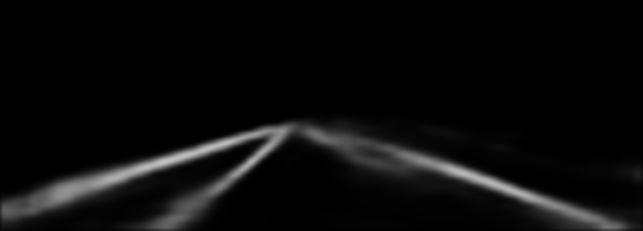

# SRResNet

## Input


Ailia input shape : (1, 288, 800, 3)
Range : [0., 255.]

## Output



Ailia output shape : [(1, 288, 800, 5), (1,4)]  
Range : [0., 1.0]

## Usage
Automatically downloads the onnx and prototxt files on the first run.
It is necessary to be connected to the Internet while downloading.

For the sample image,
``` bash
$ python3 SCNN.py
```

If you want to specify the input image, put the image path after the `--input` option.  
You can use `--savepath` option to change the name of the output file to save.
```bash
$ python3 SCNN.py --input IMAGE_PATH --savepath SAVE_IMAGE_PATH
```

The default setting is to use the optimized model and weights, but you can also switch to the normal model by using the `--normal` option.

## Reference

[Spatial As Deep: Spatial CNN for Traffic Scene Understanding](https://github.com/cardwing/Codes-for-Lane-Detection/tree/master/SCNN-Tensorflow)

## Framework

Tensorflow 1.13.2

## Model Format

ONNX opset = 11

## Netron

[SCNN.onnx.prototxt]()

[SCNN.opt.onnx.prototxt]()

