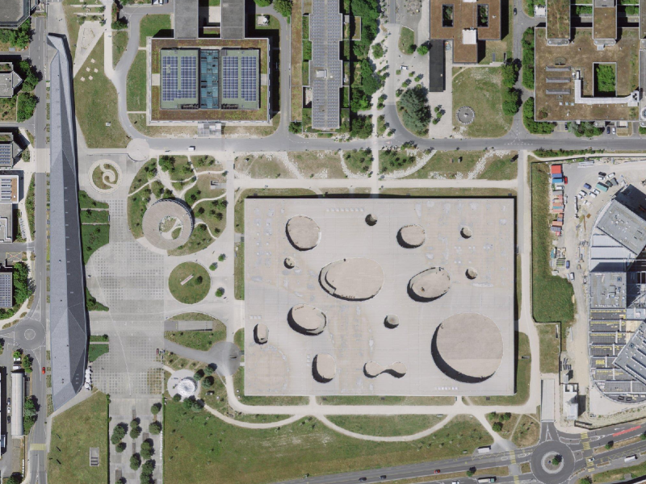
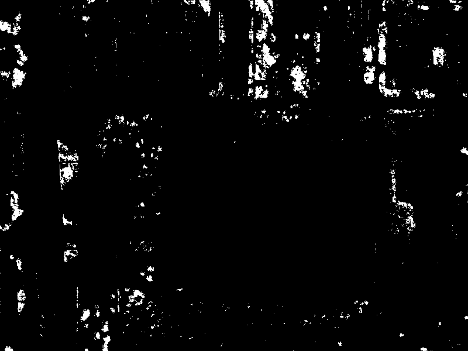

# detectree

## Input



(Image from [https://wms.geo.admin.ch/?SERVICE=WMS&REQUEST=GetMap&VERSION=1.3.0&FORMAT=image/png&LAYERS=ch.swisstopo.images-swissimage&CRS=EPSG:2056&BBOX=2532980,1152150,2533380,1152450&WIDTH=800&HEIGHT=600](https://wms.geo.admin.ch/?SERVICE=WMS&REQUEST=GetMap&VERSION=1.3.0&FORMAT=image/png&LAYERS=ch.swisstopo.images-swissimage&CRS=EPSG:2056&BBOX=2532980,1152150,2533380,1152450&WIDTH=800&HEIGHT=600))

## Output



## Requirements
This model requires additional module.

```
pip3 install -r requirments.txt
```

## Usage
Automatically downloads the onnx and prototxt files on the first run.
It is necessary to be connected to the Internet while downloading.

For the sample image,
```
$ python3 detectree.py
```

If you want to run in onnx mode, you specify `--onnx` option as below.
```
$ python3 detectree.py --onnx
```

If you want to specify the input image, put the image path after the `--input` option.  
You can use `--savepath` option to change the name of the output file to save.
```
$ python3 detectree.py --input IMAGE_PATH --savepath SAVE_IMAGE_PATH
```

By adding the `--video` option, you can input the video.   
If you pass `0` as an argument to VIDEO_PATH, you can use the webcam input instead of the video file.
```
$ python3 detectree.py --video VIDEO_PATH
```

## Reference

- [detectree](https://github.com/martibosch/detectree)

## Framework

PyTorch

## Model Format

ONNX opset=17

## Netron

[detectree.onnx.prototxt](https://netron.app/?url=https://storage.googleapis.com/ailia-models/detectree/detectree.onnx.prototxt)

