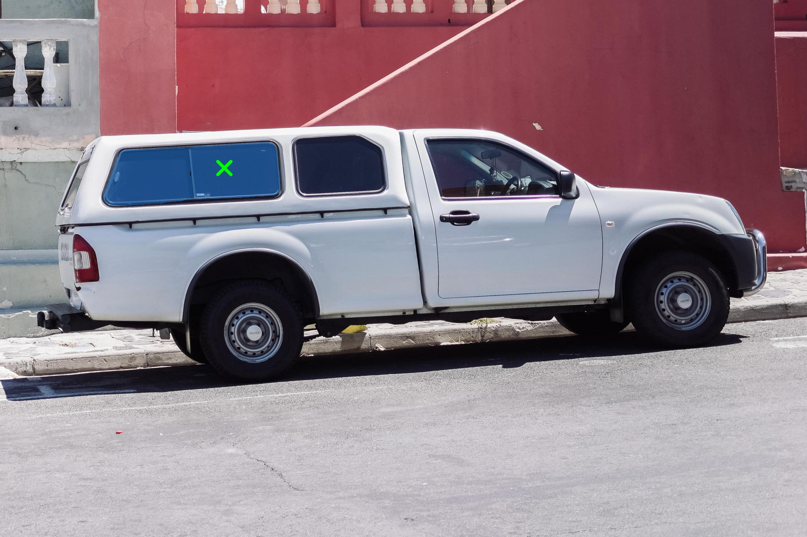

# EdgeSAM

### Input

  

(Image from https://github.com/facebookresearch/segment-anything/blob/main/notebooks/images/truck.jpg)

### Output
#### segmentation



#### Usage

Automatically downloads the onnx and prototxt files on the first run.
It is necessary to be connected to the Internet while downloading.

For the sample image,
``` bash
$ python3 edge_sam.py
```

If you want to specify the input image, put the image path after the `--input` option.  
You can use `--savepath` option to change the name of the output file to save.
```bash
$ python3 edge_sam.py --input IMAGE_PATH --savepath SAVE_IMAGE_PATH
```

If you want to specify the positive point, put the coordinates(x,y) after the `--pos` option.
```bash
$ python3 edge_sam.py --pos 500 375
```

And if you want to specify the negative point, put the coordinates after the `--neg` option.
```bash
$ python3 edge_sam.py --pos 500 375 --neg 360 405
```

If you want to specify the box, put the coordinates(x1,y1,x2,y2) after the `--box` option.
```bash
$ python3 edge_sam.py --box 425 600 700 875
```

These options can be combined.
```bash
$ python3 edge_sam.py --pos 500 375 --pos 1125 625
```

```bash
$ python3 edge_sam.py --box 425 600 700 875 --neg 575 750
```

### Reference

- [EdgeSAM](https://github.com/chongzhou96/EdgeSAM)

### Framework

PyTorch

### Model Format

ONNX opset = 11

### Netron

- [edge_sam_3x_encoder.onnx.prototxt](https://netron.app/?url=https://storage.googleapis.com/ailia-models/edge_sam/edge_sam_3x_encoder.onnx.prototxt)
- [edge_sam_3x_decoder.onnx.prototxt](https://netron.app/?url=https://storage.googleapis.com/ailia-models/edge_sam/edge_sam_3x_decoder.onnx.prototxt)
