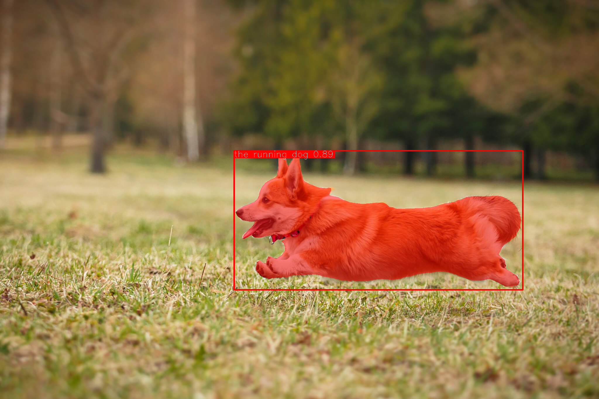

# Grounding DINO

## Input

- image


  (Image from https://github.com/IDEA-Research/Grounded-Segment-Anything/blob/main/assets/demo2.jpg)

- prompt
  ```
  The running dog.
  ```

## Output



## Requirements
This model requires additional module.

```
pip3 install ailia_tokenizer
```

## Usage
Automatically downloads the onnx and prototxt files on the first run.
It is necessary to be connected to the Internet while downloading.

For the sample image,
```bash
$ python3 grounded_sam.py
```

If you want to specify the input image, put the image path after the `--input` option.  
You can use `--savepath` option to change the name of the output file to save.
```bash
$ python3 grounded_sam.py --input IMAGE_PATH --savepath SAVE_IMAGE_PATH
```

If you want to specify the caption for detection, put the caption after the `--caption` option.
If you want to detect multiple objects in one sentence, we suggest separating each name with `.` .
An example: `cat. dog. chair.`
```bash
$ python3 grounded_sam.py --caption "The running dog."
```

## Reference

- [Grounded-SAM](https://github.com/IDEA-Research/Grounded-Segment-Anything/tree/main)

## Framework

Pytorch

## Model Format

ONNX opset=17

## Netron

[sam_vit_h_4b8939.onnx.prototxt](https://netron.app/?url=https://storage.googleapis.com/ailia-models/grounded_sam/sam_vit_h_4b8939.onnx.prototxt)
