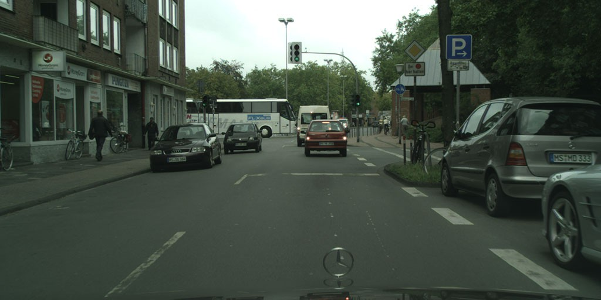
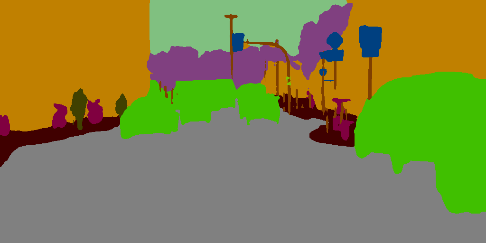

# HRNet segmentation

### input


(from https://www.cityscapes-dataset.com/)

Ailia input shape: (1, 3, 512, 1024)  
Range:[0, 1]

### output
- Normal output

  
- Smoothed output



### Usage
Automatically downloads the onnx and prototxt files on the first run.
It is necessary to be connected to the Internet while downloading.

For the sample image,
``` bash
$ python3 hrnet_segmentation.py
```

If you want to specify the input image, put the image path after the `--input` option.  
You can use `--savepath` option to change the name of the output file to save.
```bash
$ python3 hrnet_segmentation.py --input IMAGE_PATH --savepath SAVE_IMAGE_PATH
```

By adding the `--video` option, you can input the video.   
If you pass `0` as an argument to VIDEO_PATH, you can use the webcam input instead of the video file.
```bash
$ python3 hrnet_segmentation.py --video VIDEO_PATH
```

We have three pretrained-model:
  - HRNetV2-W48
  - HRNetV2-W18-Small-v1
  - HRNetV2-W18-Small-v2 (default)  
You can specify the architecture you want following `--arch` / `-a` option.
```bash
python3 hrnet_segmentation.py --arch HRNetV2-W48
```

If you want the segmentated image to be smooth, use `--smooth` option.  
By applying resize method `interpolaation=cv2.INTER_LINEAR`, the visualisation will be more smooth.
```bash
python3 hrnet_segmentation.py -a HRNetV2-W48 --smooth
```

### Reference

[High-resolution networks (HRNets) for Semantic Segmentation](https://github.com/HRNet/HRNet-Semantic-Segmentation)

### Framework
PyTorch 0.4.1

### Model Format
ONNX opset = 10

### Netron

[HRNetV2-W18-Small-v1.onnx.prototxt](https://lutzroeder.github.io/netron/?url=https://storage.googleapis.com/ailia-models/hrnet/HRNetV2-W18-Small-v1.onnx.prototxt)

[HRNetV2-W18-Small-v2.onnx.prototxt](https://lutzroeder.github.io/netron/?url=https://storage.googleapis.com/ailia-models/hrnet/HRNetV2-W18-Small-v2.onnx.prototxt)

