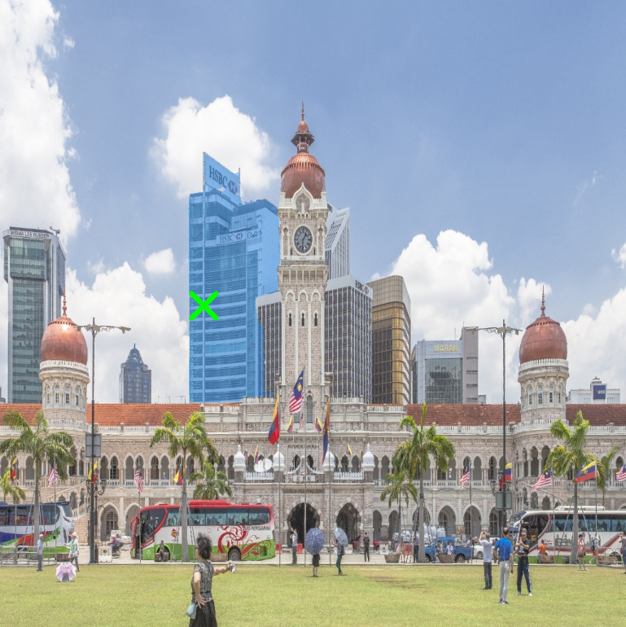
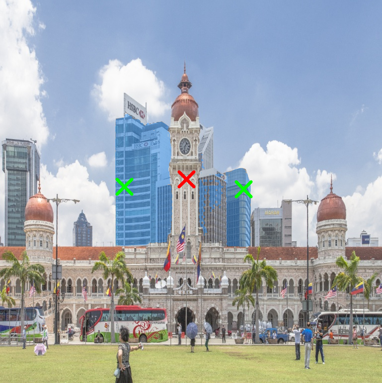

# Segment Anything

## Input


(Image from https://github.com/ChaoningZhang/MobileSAM/blob/master/notebooks/images/picture2.jpg)

## Output

- 1 positive point



- 2 positive point, 1 negative point




## Usage
Automatically downloads the onnx and prototxt files on the first run.
It is necessary to be connected to the Internet while downloading.

For the sample image,
```bash
$ python3 mobile_sam.py
```

If you want to run in onnx mode, you specify --onnx option as below.

```bash
$ python3 mobile_sam.py --onnx
```

If you want to specify the input image, put the image path after the `--input` option.  
You can use `--savepath` option to change the name of the output file to save.
```bash
$ python3 mobile_sam.py --input IMAGE_PATH --savepath SAVE_IMAGE_PATH
```

If you want to specify the positive point, put the coordinates(x,y) after the `--pos` option.
```bash
$ python mobile_sam.py  -p 250 375 
```

And if you want to specify the negative point, put the coordinates after the `--neg` option.
```bash
$ python mobile_sam.py  -p 250 375 -p 490 380 --neg 375 360

```

## Reference

- [MobileSAM](https://github.com/ChaoningZhang/MobileSAM)

## Framework

Pytorch

## Model Format

ONNX opset=17

## Netron

[mobile_sam.onnx.prototxt](https://netron.app/?url=https://storage.googleapis.com/ailia-models/mobile_sam/mobile_sam.onnx.prototxt)  
[predictor.onnx.prototxt](https://netron.app/?url=https://storage.googleapis.com/ailia-models/mobile_sam/predictor.onnx.prototxt)  

