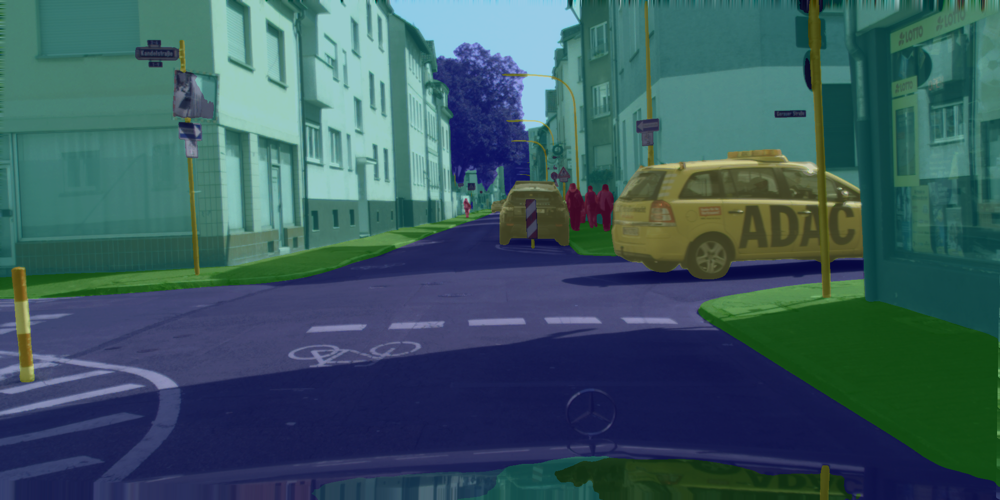

# PaddleSeg

## Input


(Image from https://www.cityscapes-dataset.com/downloads/)

## Output




## Usage
Automatically downloads the onnx and prototxt files on the first run.
It is necessary to be connected to the Internet while downloading.

For the sample image,
```bash
$ python3 paddleseg.py
```

If you want to specify the input image, put the image path after the `--input` option.  
You can use `--savepath` option to change the name of the output file to save.
```bash
$ python3 paddleseg.py --input IMAGE_PATH --savepath SAVE_IMAGE_PATH
```

By adding the `--video` option, you can input the video.   
If you pass `0` as an argument to VIDEO_PATH, you can use the webcam input instead of the video file.
```bash
$ python3 paddleseg.py --video VIDEO_PATH
```

## Reference

- [PaddleSeg](https://github.com/PaddlePaddle/PaddleSeg/tree/release/2.3/contrib/CityscapesSOTA)

## Framework

Pytorch

## Model Format

ONNX opset=11

## Netron

[mscale_ocr_cityscapes.onnx.prototxt](https://netron.app/?url=https://storage.googleapis.com/ailia-models/paddleseg/mscale_ocr_cityscapes.onnx.prototxt)
